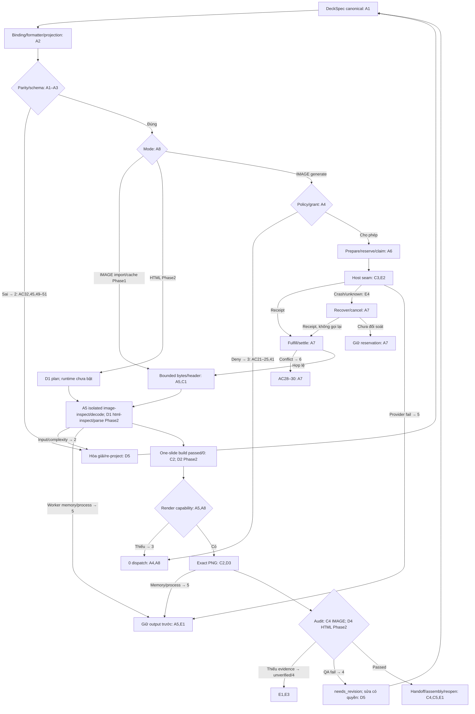
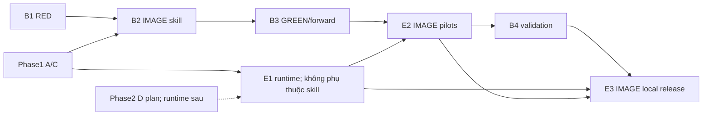

# Slide Infographic Roadmap Implementation Plan

> **For agentic workers:** REQUIRED SUB-SKILL: Use superpowers:subagent-driven-development (recommended) or superpowers:executing-plans to implement this plan task-by-task. Steps use checkbox (`- [ ]`) syntax for tracking.

**Goal:** Triển khai khả năng infographic theo từng lát cắt kiểm thử độc lập, với bằng chứng riêng cho runtime, skill và host thật.

**Architecture:** Hai workstream theo ưu tiên hiện hành: Phase1 triển khai IMAGE để test ngay; Phase2 chỉ hoàn thiện kế hoạch HTML reconstruction, runtime chưa chạy. Giữ một skill/two-mode contract, DeckSpec canonical và VisualAssetBrief; IMAGE deterministic text overlay dùng compiler/Pillow riêng, không chờ HTML backend. HyperFrames vẫn tùy chọn.

**Tech Stack:** Python >=3.12, Pydantic 2, pytest 9, Pillow 12, python-pptx 1, static HTML/CSS/SVG và browser host đã cài.

**Spec:** [Slide Infographic Design 1.1.1](../specs/2026-09-14-slide-infographic-design.md), baseline commit `71dc49c`.

## Global Constraints

- Một skill `skills/slide-infographic`; mode `IMAGE`, `HTML-RECONSTRUCTION`; không tạo state machine song song.
- Project/grant là trần, brief chỉ siết; project mặc định `max_image_requests=0`, `max_repair_rounds=0`.
- `budget_amount=0` luôn chặn generation; `max_provider_cost=None` không phải unlimited/free.
- Pilot `1920×1080`, safe area `0.05`; canvas hợp lệ `64–8192`, diện tích tối đa `33,554,432` px.
- Raw/provider metadata không biết giữ null; HTML editable không làm PPTX native; full-slide PNG trong PPTX là raster.
- `build passed/0` không chứng nhận review; thiếu render capability `3`, thiếu audit evidence `unverified/4`, QA fail `failed/4`, process/provider `5`, conflict `6`, input `2`.
- Chỉ ghi source/public fixture trung tính trong repo; request, grant, host receipt, private UAT nằm ở station.
- WP04 native đóng; không sửa `src/presentation_studio/backends/pptx_native.py`, không migration đại trà, không push/deploy trong chuỗi plan này.

---

## Phạm vi, lựa chọn và thứ tự

Đây là kế hoạch thực thi subordinate của spec đã duyệt, không thay trạng thái canonical WP. Coordinator đối chiếu kế hoạch WP03/05/06/08/09/12 thuộc quyền của họ; không có task nào chỉnh canonical OpcOS plan. Mỗi task có RED/GREEN và commit **khi thực thi được giao**; việc viết plan không thực hiện commit code.

| Plan | Deliverable testable | Owner | Dependency và gate |
|---|---|---|---|
| [A — Core](2026-09-14-slide-infographic-a-core.md) | Contract/projection/hash/policy/request/resource/CLI với fake host và fixture | Sol, vai trò contract owner duy nhất | Base WP02/state/WP04 interface; phải qua trước C/D tích hợp |
| [B — Skill](2026-09-14-slide-infographic-b-skill.md) | RED corpus, specialist, GREEN/forward evidence | Astra author/eval | Phase1 B1→B2/B3 sau A/C→E2→B4→E3; HTML capability unavailable |
| [C — IMAGE](2026-09-14-slide-infographic-c-image.md) | Import/cache, deterministic overlay PNG, raster PPTX/notes, audited assembly | Sol runtime | Phase1 A1–A8; C4 cung cấp shared audit_visual contract, C5 bắt buộc audit approved; không chờ D |
| [D — HTML](2026-09-14-slide-infographic-d-html.md) | Static source safety, offline render, QA, edit-import | Sol runtime | Phase2: plan hoàn thiện, runtime chờ giao phase sau; không dependency chặn Phase1 |
| [E — Evidence/Release](2026-09-14-slide-infographic-e-release.md) | Runtime E2E, host pilots, local release gates theo phase | Sol/Astra/coordinator | E1 không chờ B; E2 sau E1+B3; B4 sau E2; E3 sau E1/E2/B4; HTML gates giữ planned/unverified Phase1 |

Phase1 thứ tự: A1→A2→A3→A4→A5 resource/process→A6 prepare→A7 fulfill→A8→C1/C2 import/overlay PNG→C3 host→C4 raster PPTX/shared IMAGE QA→C5 audited assembly. B1 song song A; B2→B3 sau A/C; E1 IMAGE E2E chỉ phụ thuộc A/C, không skill; E2 IMAGE pilots sau E1+B3; B4 sau E2; E3 IMAGE local release sau E1/E2/B4. Phase2 mới thực thi D1–D5 và mở rộng E1/E2/B cho HTML. A chỉ thực thi runtime primitives cần IMAGE; HTML model contract/typed unavailable stubs không kéo parser/browser dependency vào Phase1.

IMAGE mặc định text overlay deterministic để giữ chính tả/safe margins; generated background không chứa body text, chữ lấy nguyên canonical. Baked là lựa chọn best-effort có QA bắt buộc; mục tiêu một primary generation, không guarantee một call hoặc vượt budget khi cần sửa. C4 hiện thực contract audit mà D4 sẽ mở rộng Phase2; C5 không được bỏ audit gate vì D chưa chạy. Không sửa WP04 hoặc mở HyperFrames runtime.

PromptPack A3: deterministic canvas/objective/hierarchy/layout/style/exclusions, reusable compact style block, whitespace normalization/dedup/stable order và actual prompt_hash. Overlay không lặp canonical body text. Estimate/ceiling/compression phải bảo toàn protectedconstraints; quátrần fail rõ trước dispatch, estimator/model/version được ghi, unknown tokenizer không có token-count guarantee. Test samebrief/hash và verbose-vs-compact reduction trên syntheticfixture, không biến thành SLA model thật.

## File ownership và luật chạy

- A sở hữu `models/visual*.py`, `models/deck.py`, `models/reports.py`, `models/__init__.py`, `visual/`, `cli.py`, `state.py`, `scripts/generate-schemas.py`, `schemas/`, `pyproject.toml` và shared test helper. Models assets/project 1.0 giữ nguyên, policy adapter chuyển Decimal riêng. D được giao các file mới `visual/html_*.py` nêu riêng trong D; A không sửa chúng khi D chạy.
- B sở hữu duy nhất package tự chứa `skills/slide-infographic/` (gồm agent, workflow, references và evals) cùng integration router text trong `skills/slide-craft/SKILL.md`; không chạm runtime/CLI.
- C sở hữu `assets/`, `backends/image_deck.py`, `renderers/image.py`, `renderers/overlay.py`, shared IMAGE `validate/` và IMAGE tests Phase1.
- D sở hữu `backends/html_static.py`, `renderers/html.py`, `visual/html_*.py` và HTML tests Phase2; chỉ tiếp quản/mở rộng shared validate files sau C4 bàn giao, không đồng thời ghi hoặc tạo QA engine mới.
- E sở hữu release test/script/docs chỉ định; thay dependency/package registration vẫn do contract owner áp dụng trong cùng task.
- Lệnh trong các plan chạy từ repo root bằng PowerShell, `python` phải là Python >=3.12 có dependency đã cài; thiếu thì dừng bước đó, không tự download. Không đọc `.env` hoặc token. Mỗi checkbox là một thao tác 2–5 phút; nếu lần implement cần lâu hơn, chia tại signature/validator/test được chỉ rõ, không bỏ RED.
- Trước mỗi task: `git status --short`, đọc file đang sửa; giữ mọi edit của người khác. Commit chỉ stage file của task, không `git add .`; file shared bận thì chờ owner bàn giao.

## User-flow → task/test branches

Nhánh W không tự lặp nếu effective repairs=0. Assembly lặp render/audit theo artifact riêng; không kế thừa pass của HTML. Mỗi command giữ status riêng trong report; diagram không là chứng cứ đã chạy.

## Coverage ledger

| Spec section / AC / E2E | Task |
|---|---|
| §1–4 goals/modes/ownership/evidence boundary | B1–B4, A8, E2/E3 |
| §5 schema/canonical/formatter; AC32–35,45–51 | A1/A2, D5, C5 |
| §5.2 policy; AC07–09,21–25,41/42 | A4/A6, C1/C3 |
| §6 hash/result/manifest; AC13–18,34–37 | A3/A8, C2/C4/C5, D4 |
| §7 host protocol; AC26–31,43 | A6/A7/C3, E1(E4) |
| §8 CLI/status; AC18–20 | A8, D4/D5, E1/E3 |
| §9 output layout; §10 security/resources; AC10–12,16,38–40,44 | A5, C1, D1–D3, E1/E3 |
| §11 QA; AC01–06,13,17–19 | D4/D5, C2/C4, E2 |
| §12 pilots/E1–E5 | E1/E2; concrete fixture mutations A–D |
| §13 skill TDD; §14 WP integration | B1–B4; roadmap dependency table |
| Yêu cầu Phase1 compact prompt/token ceiling | A3 PromptPack/compiler/tests, A6 bind prompt, B3 eval, E2 measurements |
| §15 release/privacy/observability; §16 rollback | A7/A8, E3; every plan rollback |

Tổng: **25 implementation tasks**: A8 + B4 + C5 + D5 + E3. Roadmap không thêm task thực thi trá hình.

## Gate và rollback chung

- [ ] Sau mỗi plan, đọc diff, chạy targeted tests rồi `python -m pytest -q`; native regression không được giảm. Test platform skip không thay security/visual pass.
- [ ] Đối chiếu 51 AC với evidence thật; raw/build/render/audit/host có hash riêng. Các báo cáo trong plan là yêu cầu tương lai, không là kết quả.
- [ ] Nếu rollback, disable registration capability mới, giữ artifact/revision/ledger cũ; không xóa fulfilled asset hoặc refund unknown request. Revert từng commit được chỉ định sau khi kiểm user edits; không reset worktree.

Handoff thực thi có hai cách: subagent-driven task-by-task (khuyến nghị khi đã được giao điều phối) hoặc inline bằng executing-plans. Coordinator chọn khi giao implementation; lần này chỉ bàn giao tài liệu.
