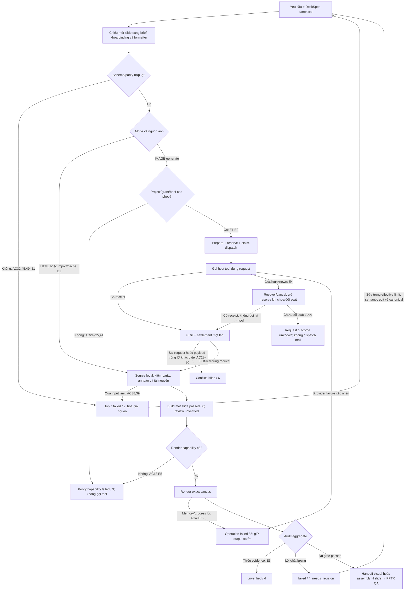

# Thiết kế infographic cho slide

## 1. Mục tiêu và phạm vi

Agent Presentation Studio có một luồng sản phẩm thống nhất: hiểu nội dung và yêu cầu thiết kế, tạo hoặc tiếp nhận ý tưởng hình ảnh, dựng nguồn phù hợp, render, kiểm chất lượng và bàn giao. Một specialist skill thuộc sản phẩm, `skills/slide-infographic`, xử lý hai mode `IMAGE` và `HTML-RECONSTRUCTION` qua một contract ngữ nghĩa chung `VisualAssetBrief`. HTML/CSS/SVG tĩnh là đường dựng source mặc định; HyperFrames là adapter tùy chọn cho chuyển động.

Tài liệu này đặc tả phần mở rộng đã được chọn về kiến trúc. Nó không chứng minh skill, provider, renderer, QA hay chuyển đổi PowerPoint đã tồn tại hoặc chạy đúng. Mã native đang được phát triển độc lập; đặc tả này không mở lại hoặc mở rộng WP04. Mỗi capability chỉ được công bố theo bằng chứng triển khai của WP sở hữu nó.

### Mục tiêu

- Tạo infographic dùng được trên slide từ brief: nội dung đúng, phân cấp rõ, quan hệ không bị mất, phong cách nhất quán.
- Dùng capability tạo ảnh ChatGPT khi host cung cấp và policy cho phép; tiếp nhận ảnh có sẵn khi không có provider hoặc ngân sách bằng không.
- Dựng lại ý tưởng/ảnh tham chiếu đã được chấp thuận thành HTML/CSS/SVG sửa được ở từng đối tượng đã khai báo; giữ source cạnh kết quả render.
- Bàn giao PNG đúng kích thước, source khi có, manifest/hash/provenance, alt text, transcript, notes, khai báo editability và QA có bằng chứng.
- Tái sử dụng lõi `ProfileLock`, `AssetManifest`, `BuildInput`, `BuildResult`, `RenderResult`, `QAReport` và cơ chế workspace/state hiện có.

### Không thuộc phạm vi

- Không tạo repo, framework agent, provider server hoặc state machine riêng cho infographic.
- Không cam kết clone pixel tuyệt đối từ mọi ảnh, nhận đúng mọi font từ raster, hoặc suy ra phần nội dung bị cắt/mờ.
- Không coi ảnh nền toàn slide là tái dựng chỉnh sửa được; không coi HTML sửa được là PowerPoint native.
- Không bổ sung SmartArt, chart native, native overlay hoặc layout mới vào WP04 theo đặc tả này. Image-deck và khả năng mixed của WP08 phải được kiểm riêng.
- Không tự tải model, browser, package, font, asset từ mạng; không tự đăng sản phẩm, đồng bộ profile hay triển khai skill sang harness khác.
- Không trích xuất toàn bộ tài khoản/project ChatGPT; không đưa hội thoại riêng, ảnh riêng hoặc dữ liệu nhận diện vào source public.

### Các lựa chọn kiến trúc

| Cách làm | Đánh đổi và rủi ro | Công sức | Khi nên chọn |
|---|---|---|---|
| **Đã chọn: một skill, hai mode, một brief chung** | Cần giữ mapping ngữ nghĩa và editability chặt giữa các backend | Vừa; tái sử dụng core | Sản phẩm cần cả ảnh nhanh và source web sửa được |
| Hai skill độc lập cho ảnh và web | Dễ triển khai riêng nhưng brief, QA và quyền nguồn có thể lệch | Cao hơn khi tích hợp | Chỉ khi trở thành hai sản phẩm với vòng đời độc lập |
| Chỉ tạo ảnh rồi đưa vào slide | Nhanh, ít dependency; không đáp ứng sửa cấu trúc | Thấp | Công việc chỉ cần raster và chấp nhận khai báo đó |

Giữ tên `VisualAssetBrief`: đối tượng chiếu nội dung canonical của DeckSpec thành yêu cầu thiết kế một visual trước khi chọn provider/render; không phải nguồn nội dung độc lập hay prompt tạo ảnh. Không đổi tên theo backend.

## 2. Cơ sở yêu cầu và giới hạn bằng chứng

Phân tích nhu cầu trước đặc tả bao phủ 16 thông điệp yêu cầu/chỉnh sửa trong một cuộc trao đổi về slide, một yêu cầu tham chiếu sản phẩm, bốn ảnh được xem trực tiếp, và một tác vụ HyperFrames/website. Việc liệt kê project chưa đầy đủ; đây không phải khảo sát toàn bộ lịch sử hay tập dữ liệu đại diện thống kê.

Hai infographic đã xem không có tỷ lệ chính xác 16:9 dù yêu cầu đề cập tỷ lệ đó. Tiền lệ HyperFrames sử dụng canvas khác 16:9; website quan sát được nhúng poster raster. Những quan sát này chỉ làm căn cứ cho taxonomy, kiểm kích thước thật và private UAT, không chứng minh tái dựng chỉnh sửa được hoặc chất lượng renderer của sản phẩm.

Không kèm nguồn riêng trong tài liệu public. Public test dùng nội dung trung tính tự viết và asset có quyền; private UAT giữ ảnh, prompt và nguồn truy nguyên trong station. Không dùng chi tiết của bốn ảnh làm fixture công khai.

## 3. User story, thuật ngữ và định tuyến

| ID | Nhu cầu | Kết quả người dùng kiểm được |
|---|---|---|
| US01 | Từ bốn ý tiếng Việt, tạo một infographic nằm ngang | Đủ bốn ý/quan hệ, chữ đúng dấu, PNG đúng canvas, khai text policy |
| US02 | Từ ảnh đã duyệt, sửa nhãn và đổi thứ tự nhóm | Source HTML/SVG có ID ngữ nghĩa; sửa rồi render tạo thay đổi đúng vị trí |
| US03 | Giữ nội dung của ảnh tham chiếu nhưng đổi sang thiết kế thoáng hơn | Chế độ inspired-redesign rõ ràng, content diff không mất dữ kiện |
| US04 | Tạo hình nền công nghệ tối, không chữ | PNG không có chữ/ký hiệu giả chữ; alt text mô tả hình, transcript rỗng |
| US05 | Chạy khi không có ngân sách hoặc không có image tool | Không gọi provider; báo capability/policy hoặc dùng input/cache hợp lệ |
| US06 | Nhận PowerPoint để trình chiếu và biết sửa được phần nào | File mở/render được; báo raster/native/mixed theo đối tượng và output |

`IMAGE` là tạo/tiếp nhận hình raster theo brief. `HTML-RECONSTRUCTION` là diễn giải nội dung/quan hệ thành các phần tử HTML/CSS/SVG; không phải phép nhúng ảnh rồi đổi nhãn capability. `faithful` giữ nội dung, cấu trúc và các đặc điểm thị giác đã khóa. `inspired-redesign` giữ nội dung và các quan hệ đã khóa, cho phép bố cục/phong cách đổi theo brief. `editability` luôn gắn với một artifact và tập đối tượng, không gắn với tên extension.

| Điều kiện quan sát được | Mode | Text policy | Backend/adapter đích | Điều kiện hoàn tất |
|---|---|---|---|---|
| Cần một ảnh dùng ngay, chấp nhận chữ nằm trong ảnh | IMAGE | baked | WP08 image provider/import | Kiểm chữ trong PNG, khai raster |
| Cần hình minh họa và chữ độc lập | IMAGE | overlay | WP08 asset + WP05 compositor tĩnh | Chữ nằm ngoài ảnh gốc, source lớp chữ có thật |
| Chỉ cần visual không chữ | IMAGE | none | WP08 image provider/import | Không có text node hiển thị và không phát hiện chữ trong ảnh |
| Cần tái dựng ảnh và sửa nội dung/bố cục | HTML-RECONSTRUCTION | overlay | WP05 static HTML/CSS/SVG | Mapping phần tử và edit-then-render đạt |
| Tái dựng một visual không chữ | HTML-RECONSTRUCTION | none | WP05 static HTML/CSS/SVG | Các đối tượng được yêu cầu sửa có source riêng |
| Yêu cầu giữ nguyên toàn ảnh, chỉ bọc HTML | IMAGE | baked hoặc none | WP05 wrapper nếu được yêu cầu | Khai raster; không cấp reconstruction capability |
| Cần motion sau khi hình tĩnh được duyệt | Giữ mode gốc | Giữ text policy | WP09 HyperFrames tùy chọn | Static QA đạt trước; kiểm timeline/frame riêng |
| Yêu cầu toàn bộ object PowerPoint native | Router ngoài specialist | Không tự chọn | Capability native đã được chứng nhận | Không âm thầm chuyển sang raster/mixed |

`HTML-RECONSTRUCTION + baked` không hợp lệ trong v1: yêu cầu đó đi qua IMAGE. Một số thành phần trang trí vẫn có thể là raster trong reconstruction; chúng phải khai riêng và không được nằm trong tập đối tượng bắt buộc chỉnh sửa.

Mặc định pilot là 1920×1080 px, safe area 5% mỗi cạnh. Đây là preset đo được, không phải chứng nhận cho mọi canvas. Người dùng chọn canvas khác thì lưu số đo chính xác và chạy lại QA. Ưu tiên tiếng Việt cho title/body trừ tên riêng chỉ là preset có thể ghi đè; bố cục nằm ngang, card nền trắng, màu nhóm, icon và phong cách đồng nhất là lựa chọn, không phải luật bắt buộc. Lane `dark-tech-no-text` tách khỏi lane chữ tiếng Việt. Không cố định số card/cột cho mọi brief.

## 4. Thành phần và quyền sở hữu

| Thành phần | Trách nhiệm | Không được làm |
|---|---|---|
| WP03 router/producer | Chọn mode, tận dụng dữ kiện sẵn có, giữ revision, quyết định giao việc | Không chứng nhận capability dựa vào mô tả skill |
| `skills/slide-infographic` — Astra | Cách phân tích ý nghĩa, chọn layout/text policy, đọc ảnh trực tiếp khi có vision, hướng dẫn QA và handoff | Không tự ghi state, giấu provider call hoặc tạo backend trong skill |
| WP03 visual-specialist | Thực thi skill, tạo brief/ý tưởng/source candidate trong phạm vi được giao | Không tự đổi nội dung khóa hoặc xuất bản |
| Core models/workspace/state — Sol, qua coordinator | Validate, bind identity, hash, lock, journal, promotion | Không tạo đường ghi file yếu hơn cho HTML/ảnh |
| WP08 image adapters — Sol | Capability, request/result, nhập ảnh, metadata, cache, image-deck | Không gọi host tool từ CLI nếu host không cung cấp bridge |
| WP05 HTML backend/renderer — Sol | Bundle tĩnh, text/SVG riêng, render offline, đo DOM/font/assets | Không thực thi HTML chưa được kiểm và cách ly |
| WP06 QA — Sol | Kiểm ngữ nghĩa, geometry, fidelity, editability, provenance và vòng sửa giới hạn | Không lấy điểm trung bình che lỗi nội dung |
| WP09 motion — Sol | Chuyển source đã duyệt sang timeline và frame/video | Không bắt motion làm dependency của ảnh tĩnh |

Astra sở hữu authoring và eval của specialist skill; Sol sở hữu runtime và kiểm thử runtime. Schema, CLI, dependency và các file dùng chung chỉ có một owner tích hợp do coordinator chỉ định. Các worker đề xuất thay đổi contract qua owner; không đồng thời sửa các model/CLI. Skill mới thuộc repo sản phẩm; tích hợp OpcOS sau này là bước phân phối có cấp quyền riêng.

### Luồng dữ liệu chính xác

1. Producer tiếp nhận yêu cầu cùng DeckSpec, input asset đã chọn và profile. Vision đọc ảnh trực tiếp nếu có; nội dung nhập từ ảnh phải được hòa giải vào DeckSpec trước khi thành content canonical. Thiếu vision hoặc hai nguồn bất đồng thì giữ unverified, không đoán dữ kiện.
2. Chiếu đúng một slide của DeckSpec sang brief theo mapping ở §5.1; khóa reference, editability và QA policy. Chạy parity ba phía DeckSpec → brief → source candidate. Brief và DOM không có quyền âm thầm sửa nội dung canonical.
3. Core kiểm input sơ bộ; lấy RunLock hiện có, đọc lại project/grant/ledger bằng identity, chạy `resolve_effective_policy`, bind byte/hash/revision và memory admission. Lock và grant được kiểm lại trước mọi ghi hoặc side effect; bước preflight ngoài lock không cấp quyền thực thi.
4. IMAGE dùng cache/import đúng `image_source`; generate chỉ đi qua prepare/fulfill ở §7.1. Prepare khóa semantic hash, reserve dưới trần project và tạo request bất biến. Host claim dispatch dưới RunLock, gọi tool đúng request rồi fulfill; standalone adapter dùng cùng protocol. Không có đường gọi provider trước reserve hoặc ngoài protocol. Trần lượt bằng 0 hoặc brief budget_amount=0 đều chặn generation.
5. HTML-RECONSTRUCTION nhận reference và DeckSpec projection đã khóa. Specialist tạo source candidate; WP05 kiểm parity, DOM/CSS/SVG, dependency, tài nguyên và isolation trước render. HTML input luôn không tin cậy.
6. IMAGE overlay ghép ảnh nền với text/SVG từ projection; baked/none giữ raster. Kích thước trả về khác thì áp fit policy được khóa, ghi transformation; không tự crop/kéo méo.
7. Tạo BuildInput chứa deck projection đúng một slide, giữ slide_id gốc. Backend tạo BuildResult đầy đủ cho một slide rồi promotion build revision bất biến; `build` có thể passed/0 trong khi review còn unverified. PNG được renderer tạo trong bước render, QA chưa chạy không chặn việc lưu build thành công.
8. Renderer ghi RenderResult; WP06 audit trên cùng input_hash và artifact hash. Mỗi report/evidence là snapshot bất biến mới, không overwrite report cũ. Producer chỉ sửa trong min(project, grant, brief) repair limit; mỗi sửa tạo revision mới và dùng budget project còn lại.
9. Aggregate/handoff đánh giá report hiện hành: thiếu evidence là unverified/4, lỗi QA là needs_revision với exit 4; không đổi trạng thái build đã thành công. Assembly nhiều visual thành image-deck là build riêng theo §6; export/reopen/render PPTX và QA deck có bằng chứng riêng.

Các bước build, render, audit và export giữ command boundary hiện có. Host có thể hoàn tất image tool giữa hai command; protocol fulfillment bind kết quả vào request/hash cũ trước khi producer quyết định dùng. Source edit chỉ layout giữ content hash; semantic edit phải re-import vào DeckSpec và chiếu lại brief. Không tái dùng evidence khác content/render hash.

## 5. Contract `VisualAssetBrief` v1.0

Đây là model mới được đề xuất tại `models/visual.py`, schema sinh bằng generator của repo. Tất cả object dùng `StrictModel`, `extra=forbid`; không nhét field tùy ý vào YAML. Tái sử dụng `Identifier`, `RelativePath`, `SHA256`, `ProfileLock`, `EvidenceRef`. `schema_version` v1.0 tương thích literal hiện có; đổi ngữ nghĩa breaking phải tạo version và migration tường minh trước khi nhận input mới.

| Field | Kiểu và ràng buộc |
|---|---|
| `schema_version` | Literal `"1.0"`, bắt buộc trong file trao đổi |
| `id`, `slide_id` | Identifier, bắt buộc; slide phải tồn tại trong deck |
| `deck_binding` | Object `deck_ref: RelativePath`, `deck_raw_sha256: SHA256`, `slide_content_hash: SHA256`, `projection_version: "1.0"`; byte binding và hash nội dung tách biệt |
| `revision` | Integer ≥1; tăng khi bất kỳ nội dung hay quyết định khóa thay đổi |
| `mode` | Enum `IMAGE`, `HTML-RECONSTRUCTION` |
| `purpose`, `audience` | String không rỗng, mỗi field ≤4000 ký tự; chiếu từ DeckSpec |
| `message` | String ≤4000 ký tự hoặc null; đúng SlideSpec.message |
| `language` | String language tag dài 2–35; pilot `vi`, runtime không tự dịch |
| `proper_names` | List string không rỗng, duy nhất; giữ nguyên chính tả nguồn |
| `canvas` | Object `width_px`, `height_px`: integer 64–8192; diện tích ≤33,554,432 px; `safe_area`: object `top/right/bottom/left`, fraction 0–0.25; `background`: màu `#RRGGBB` |
| `text_policy` | Enum `baked`, `overlay`, `none` |
| `nodes` | List 1–200 `VisualNode`, ID duy nhất; có thứ tự khai báo nhưng reading order khai riêng |
| `relations` | List 0–400 `VisualRelation`, ID duy nhất |
| `reading_order` | List node ID, không trùng; chứa mỗi node `visible=true` đúng một lần |
| `references` | List 0–8 `VisualReference`; asset phải có trong manifest |
| `reconstruction_policy` | `faithful`, `inspired-redesign` hoặc null; bắt buộc khi mode reconstruction, null với IMAGE |
| `style` | Object được định nghĩa bên dưới; mọi giá trị đã resolve qua profile/override |
| `number_formatters` | Dict node ID → NumberFormatter strict theo §5.1; bắt buộc entry cho mọi chart-value/table-cell numeric hiển thị; key ngoài node số bị từ chối |
| `profile_lock` | ProfileLock bắt buộc; dùng profile builtin trung tính khi chưa chọn style, không giả profile từ ảnh |
| `editability` | Object `required_node_ids`: list ID duy nhất; `target`: enum `raster`, `html-source`, `pptx-native`, `mixed`; `allow_raster_decoration`: boolean |
| `fit_policy` | Enum `reject`, `contain`, `crop-approved`; mặc định `reject`; không có stretch |
| `crop` | Null hoặc object `reference_asset_id`, `x/y/width/height` normalized 0–1; width/height >0; khung nằm trong ảnh; chỉ có khi `crop-approved` |
| `motion` | Object `enabled`: boolean; `adapter`: null hoặc `hyperframes`; `duration_seconds`: null hoặc số >0 và ≤120; `fps`: null hoặc integer 1–60 |
| `execution` | Object policy tài nguyên, định nghĩa bên dưới |
| `deliverables` | List duy nhất, ≥1 từ `png`, `html-source`, `pptx`, `motion-video`; PNG luôn bắt buộc; source bắt buộc với reconstruction/overlay |
| `accessibility` | Object `alt_text`: string 1–4000; `transcript`: string ≤20000; `notes`: string ≤20000 |
| `qa_policy` | Object `required_rule_ids`: list Identifier; `max_repair_rounds`: integer 0–2 mặc định 2; `fidelity_tolerances`: object định nghĩa bên dưới |
| `approval` | Null hoặc object `scope`: `brief`, `reference`, `design`; `approved_content_hash`: SHA256; `evidence`: EvidenceRef. Chỉ producer được ghi khi có căn cứ cho đúng hash |

`VisualNode` gồm `id: Identifier`, `kind: title|text|group|icon|shape|image|data-label`, `content_binding: ContentBinding`, `text: string|null` (≤4000), `parent_id: Identifier|null`, `visible: boolean`, `required: boolean`, `asset_ref: Identifier|null`, `semantic_role: string` (1–128), `facts: list[Fact]`, `preferred_box: Box|null`. Fact strict gồm `id: Identifier`, `binding: ContentBinding`, `value_type: string|decimal`, `value: string` (1–1000), `source_ref: Identifier`; nguồn phải có trong DeckSpec.sources, value là canonical scalar theo binding, không phải text đã format. Chi tiết fact label/value/unit và dedup ở §5.1. `Box` gồm `x/y/width/height` normalized, width/height >0, nằm trong canvas. Box là yêu cầu vị trí, không phải số đo render. Text đúng chuỗi Unicode NFC; không tự rút gọn khi hết chỗ. ContentBinding được định nghĩa ở §5.1.

`VisualRelation` gồm `id: Identifier`, `from_id/to_id: Identifier`, `kind: sequence|branch|cycle|contains|compares|associates`, `label: string|null` (≤1000), `required: boolean`. Mỗi endpoint phải tồn tại. Quan hệ `contains` phải khớp `parent_id`; cây parent không có chu kỳ. `cycle` trong graph được phép và không được ép thành cây. Khi có graph so sánh/nhánh phải giữ đúng loại, hướng và nhãn cạnh, không chỉ số lượng node.

`VisualReference` gồm `asset_ref: Identifier`, `sha256: SHA256`, `role: composition|style|content|locked-design`, `inspection: measured|inferred|unverified`, `evidence_refs: list[EvidenceRef]`, `locked_features: list[content|relations|geometry|palette|typography|decoration]`. Hash phải khớp byte đã đọc, không chỉ tên file. `measured` và `inferred` cần evidence không rỗng; phần không nhìn thấy không được ghi measured. Reconstruction cần ít nhất một reference composition/content/locked-design; inspired redesign vẫn phải có nguồn nội dung được khóa.

`style` gồm `preset_id: Identifier|null`, `archetype: Identifier`, `density: sparse|balanced|dense`, `palette_roles: dict[Identifier, #RRGGBB]`, `font_roles: dict[Identifier, string]`, `icon_family: Identifier|null`, `constraints: list[string]` (mỗi chuỗi 1–1000, tối đa 50). Archetype phải có trong catalog khả dụng hoặc là `custom` với source được kiểm; không suy supported từ tên. Palette/font override nằm cả trong `ProfileLock.applied_overrides` với origin/evidence, kiểm nhất quán trước build.

`execution` gồm `network: offline|provider-only` (mặc định offline), `image_source: generate|import|cache-only`, `import_asset_id: Identifier|null`, `provider_id/model_id: string|null`, `max_provider_calls: integer 0–6` (mặc định 0), `accounting_mode: none|host-quota|monetary`, `budget_amount: decimal string không âm|null` (mặc định `"0"`), `currency: string [A-Z]{3}|null`, `timeout_seconds: integer 1–600` (mặc định 120), `reference_egress_allowed: boolean` (mặc định false), `grant_ref: RelativePath|null`. Decimal string tối đa 12 chữ số phần nguyên, 6 phần thập phân, không exponent; tiền tính bằng Decimal. Provider nhận ID, không nhận URL/câu lệnh. Import cần import_asset_id; generate cần provider/model và effective policy cho phép; cache-only không gọi mạng. max_provider_calls tính cả retry, nhưng không vượt trần project/grant ở §5.2. `none` chỉ dùng import/cache; host-quota cần budget_amount=null, currency=null và grant cấp quota tường minh; monetary cần amount/currency khác null. Giá trị budget_amount=0 luôn chặn generation, kể cả host khai miễn phí.

`fidelity_tolerances` gồm `box_tolerance_px: number 0–256|null`, `ssim_min: number 0–1|null`, `iou_min: number 0–1|null`, `delta_e_max: number 0–100|null`. Null nghĩa chưa yêu cầu phép đo đó, không nghĩa đã đạt. Ngưỡng chỉ có hiệu lực đối với vùng/đặc điểm đã khóa ở reference và phải nằm trong hash duyệt trước render. Không tự chọn ngưỡng sau khi xem điểm. QA ngữ nghĩa, chữ và editability không thể bị tắt bằng những field này.

`approval=null` cho phép validate và lưu draft; build/provider chỉ chạy khi producer xác lập căn cứ cho phạm vi đang làm. Căn cứ có thể là ủy quyền sẵn có của task, không bắt buộc hỏi lại từng command. approved_content_hash bằng semantic_hash được định nghĩa chính xác ở §6; raw byte/evidence/timestamp tách khỏi hash này. Reconstruction cần scope reference hoặc design; IMAGE cần tối thiểu scope brief. Approval chốt nội dung không thay thế execution grant: brief không tự cấp quyền tăng budget/network.

Với reconstruction v1, `execution.image_source=import`, `import_asset_id` là reference chính và `max_provider_calls=0`: không gọi image provider ngầm để bù thành phần. Muốn tạo thêm visual bằng IMAGE thì producer thực hiện một brief IMAGE riêng và đưa asset đã duyệt vào manifest reconstruction. Source authoring bằng host agent không được runtime giả lập thành một provider call; chi phí/capability của host agent báo riêng nếu đo được.

### Các validation liên trường bắt buộc

1. `none` không cho phép text ở node hiển thị, nhãn cạnh hiển thị hoặc transcript khác rỗng. Alt text và notes vẫn phải có nghĩa. IMAGE none phải kiểm chữ ngoài ý muốn trong raster.
2. Text node hiển thị ở `baked/overlay` phải có text không rỗng. Transcript bao gồm toàn bộ text/nhãn có nghĩa theo reading order; được bổ sung câu mô tả quan hệ nhưng không thay thế text gốc. Tất cả required facts phải xuất hiện trong nội dung hoặc transcript theo policy hiển thị đã khóa.
3. Required node/edge không được mất khỏi reconstruction hay bị gộp vào ảnh toàn slide nếu nằm trong `required_node_ids`. Với faithful, content và relations luôn khóa; box/palette/font chỉ khóa khi có quan sát đủ căn cứ.
4. Profile hash trong brief bằng BuildInput.profile_lock.sha256; deck_binding khớp DeckSpec canonical và parity mapping. Deck projection cho build một visual dùng custom px với đúng width/height; canvas deck nguồn không bị ghi đè và ratio phải tương thích hoặc có fit policy được duyệt.
5. `fit_policy=crop-approved` cần crop và approval có hash khớp; các fit policy khác phải có `crop=null`. Crop không được bỏ required node/edge/text; nếu reference không xác minh được vùng bắt buộc thì không crop.
6. `motion.enabled=false` yêu cầu các field motion còn lại null; true yêu cầu đủ adapter/duration/fps và motion-video. Không có HyperFrames capability thì dừng nhánh motion, không tự đổi kết quả thành video tĩnh.
7. `target=pptx-native` không được specialist v1 nhận là đã hỗ trợ. Router trả về capability native hoặc báo thiếu; `mixed` cần khai tập node chỉnh sửa và được backend xuất chứng minh.
8. Unknown field, ID thừa, parent cycle, sai tỷ lệ, dimension vượt trần, reference hash lệch hoặc revision approval cũ đều là lỗi input trước provider/render.

### 5.1. DeckSpec canonical và projection nội dung

DeckSpec là nguồn duy nhất cho nội dung có nghĩa: title/message/text/số liệu/notes, thứ tự đọc và quan hệ. Brief thêm quyết định thiết kế và sao chiếu giá trị để provider sử dụng; không có quyền chọn một giá trị khác khi bất đồng. Source HTML là biểu diễn. Khi nhập ảnh lần đầu, producer dựng candidate DeckSpec, đối chiếu nguồn/vision và chốt content revision trước build.

Core contract slice đề xuất field optional `SlideSpec.visual_semantics` để biểu diễn graph đầy đủ mà ProcessContent hiện chưa biểu diễn được. Object gồm `nodes: list[SemanticNode]`, `relations: list[VisualRelation]`, `reading_order: list[Identifier]`. SemanticNode có `id/kind/content_binding/parent_id/visible/required/semantic_role/facts/asset_ref`; không có text hoặc preferred_box lặp lại. Text lấy từ content_binding. Text-bearing facts phải trỏ SourceRef và field nội dung cùng value. Group/shape trang trí không text dùng binding đến chính node semantic; nội dung hình có nghĩa nằm ở asset_ref và alt_text của ImageElement. Graph chỉ sống canonical trong field này; brief.relations là projection có parity, không phải graph thứ hai được chỉnh riêng.

Đây là thay đổi schema được đề xuất thuộc owner core, không được lén thêm vào schema 1.0 đã phát hành: reader mới nhận DeckSpec 1.0 và 1.1; chỉ emit 1.1 khi có visual_semantics, reader 1.0 từ chối 1.1 rõ. BuildInput vẫn dùng model hiện có nhưng dependency DeckSpec reader được nâng theo contract test; không đổi enum lifecycle/status hay backend WP04. Deck 1.0 có thể chiếu title/text/image/process tuyến tính bằng adapter nội dung; graph ngoài khả năng 1.0 cần migrate explicit sang 1.1 trước build. Schema generator tạo đủ fixtures backward/forward, không sửa global SchemaVersion của model khác thành 1.1 hàng loạt.

Writer phải serialize theo schema version đích, không gọi model_dump chung rồi chỉ đổi schema_version. Khi emit DeckSpec 1.0, mọi slide phải bỏ hẳn key visual_semantics cùng mọi field mới của 1.1, kể cả khi giá trị trong memory là null; không serialize `visual_semantics:null`. Không chỉ dựa vào exclude_none toàn cục vì field khác của schema 1.0 có thể có semantics nullable cần giữ. Chỉ emit 1.1 khi ít nhất một slide có visual_semantics object khác null; mọi yêu cầu emit1.0 với object khác null bị từ chối LOSSY_DOWNGRADE/2, không drop graph. Compatibility test phải dùng reader 1.0 được khóa ở bản cũ với extra=forbid để đọc byte writer mới phát, không dùng chính reader mới làm đại diện.

ContentBinding là object strict `slide_id: Identifier`, `element_id: Identifier|null`, `field: Identifier`, `item_id: Identifier|null`, `item_index: integer>=0|null`. Chỉ dùng allowlist sau; runtime truy cập field bằng dispatch, không eval/JSONPath tùy ý. ID là ổn định, index chỉ cho list nguồn không có ID; khi reorder list phải chiếu lại mọi index và parity.

| Node/field trong brief | Binding canonical | Projection và kiểm |
|---|---|---|
| title.text | element_id=null, field=slide-title | SlideSpec.title, Unicode NFC, nguyên chuỗi |
| message | Field slide-message của slide | SlideSpec.message, null được giữ null; message brief không được bịa nếu canonical null |
| audience/purpose | Field deck-audience/deck-purpose | DeckSpec.audience/purpose |
| text.text | element_id có thật; field=text-content hoặc text-label | TextElement.content string hoặc TextContent.text/label |
| text list item | field=text-item, item_index bắt buộc | TextContent.items[index], không truncate |
| process title/body | field=process-title/process-description, item_id bắt buộc | ProcessContent.steps ID tương ứng |
| quote/code/table | field=quote-text/code-text/table-cell | Truyền đúng typed field; v1 table-cell dùng item_index hàng và item_id dạng col-N |
| chart label | ChartBinding field=chart-label, item_index=i, item_id=null | ChartDatum.label tại /slides/S/elements/E/content/data/i/label; chuỗi NFC nguyên bản |
| chart value | ChartBinding field=chart-value, item_index=i, item_id=null | ChartDatum.value tại /slides/S/elements/E/content/data/i/value; numeric scalar canonical trước formatter |
| chart unit | ChartBinding field=chart-unit, item_index=null, item_id=null | ChartContent.unit tại /slides/S/elements/E/content/unit; giữ string/null gốc, không suy unit từ label |
| unit hiển thị | ChartBinding field=display-unit, item_index=null, item_id=null | Cùng pointer ChartContent.unit; node.text là unit NFC nguyên chuỗi; đây là alias biểu diễn, không là nguồn unit thứ hai |
| image/icon | field=image-content/image-alt | ImageElement.content.asset_ref và alt_text; icon có nghĩa dùng ImageElement |
| group/shape decoration | element_id=null, field=semantic-node, item_id=node ID | visual_semantics.nodes, text=null; không tạo dữ kiện mới |
| parent/relations/reading_order/facts | visual_semantics tương ứng | So ID, loại/hướng/nhãn cạnh, thứ tự và fact value chính xác |
| accessibility.notes | field=slide-notes | SlideSpec.notes hoặc chuỗi rỗng nếu null |

Các pointer trong bảng là kết quả resolution chỉ đọc: S được tìm bằng slide_id, E bằng element_id, i bằng item_index trong snapshot DeckSpec đã khóa; runtime không nhận pointer do model gõ làm lệnh truy cập. Source mapping evidence ghi cả binding typed, pointer resolved và canonical deck raw hash để phát hiện reorder/index drift. ChartBinding là discriminated subtype của ContentBinding: field thuộc chart-label/chart-value/chart-unit/display-unit, element_id bắt buộc và element.kind=chart; label/value yêu cầu item_index trong data, unit/display-unit bắt buộc hai item field null. Binding sai subtype hoặc trỏ quá index bị từ chối trước generation. Unit null không được tự đổi thành %, lần hay tiền; nếu brief yêu cầu node unit hiển thị thì null là input thiếu, không được render chuỗi “null”. Unit chỉ hiển thị một lần ở cấp chart được phép nếu mapping và reading order chỉ rõ nó áp dụng cho những datum nào.

NumberFormatter strict gồm `formatter_id: fixed-decimal`, `version: SemVer`, `locale: vi-VN|en-US`, `precision: integer 0–12`, `rounding: reject-inexact|half-even|half-up`, `grouping: boolean`, `trim_trailing_zeros: boolean`, `approximation_marker: none|prefix`. V1 cung cấp formatter version1.0.0; version khác dù đúng SemVer vẫn cần registry capability, thiếu trả unavailable/3, không tự fallback. V1 không nhận formatter tùy ý hoặc locale theo OS. Numeric source chuyển bằng Decimal(str(canonical value)), reject NaN/Infinity; raw byte nguồn vẫn giữ. Formatter lượng tử hóa theo precision; reject-inexact là mặc định và fail nếu phải mất chữ số khác 0. Rounding khác chỉ được dùng khi semantic_hash có đúng lựa chọn đã duyệt; nếu kết quả khác số gốc thì approximation_marker=prefix bắt buộc, text dùng dấu ≈ và transcript giữ nguyên giá trị nguồn cùng chú thích làm tròn. Nếu precision chỉ thêm/bỏ zero không đổi giá trị thì không cần ≈. Dấu decimal/group vi-VN là dấu phẩy/chấm, en-US là chấm/phẩy; grouping=false không thêm separator nhóm, trim_trailing_zeros áp sau lượng tử hóa. Không nhân 100, đổi đơn vị hoặc currency ngầm; display-unit v1 giữ nguyên ChartContent.unit. Muốn đổi unit/scale phải chỉnh dữ liệu canonical có căn cứ rồi re-project, không nhét conversion vào formatter.

Mỗi numeric node hiển thị có đúng một NumberFormatter trong brief.number_formatters; node.text được sinh từ canonical value và formatter, không cho người/model điền chuỗi tùy ý khác. Formatter snapshot có ID/version/locale/precision/rounding/grouping/trim/marker và hash trong output provenance. Backend cần thư viện locale phải khóa version/hash; v1 chỉ hai locale nói trên, thiếu implementation trả capability unavailable. Binding table-cell numeric dùng cùng contract; string cell không cần number formatter. Các field chưa liệt kê báo unsupported, không stringify object để lách mapping.

Fact parity không so canonical number với chuỗi có dấu phân cách như hai string ngang nhau. Numeric Fact.value là decimal string chuẩn không grouping, giữ đủ giá trị canonical (18.5), value_type=decimal và binding=chart-value; node.text có thể là “18,5” theo vi-VN. Label Fact dùng binding=chart-label/value_type=string, unit Fact dùng chart-unit/value_type=string. Runtime gom theo khóa `(slide_id, element_id, canonical data index)` để đối chiếu đủ bộ label/value và shared unit ở cấp chart, không ghép label của datum này với value của datum khác. Source_ref của fact chart phải bằng ChartContent.source_ref và resolve; nếu thiếu nguồn thì provenance unverified hoặc input thiếu theo qa_policy, không bịa SourceRef. Bản nhập không nguồn chưa được tạo Fact hợp lệ; nó vẫn giữ value canonical để người dùng bổ sung nguồn.

Trong visual_semantics, một resolved scalar pointer chỉ có một Fact owner và ID, các node lặp lại cùng số/label/unit chỉ dùng ContentBinding và facts rỗng; không sao chép thêm Fact.value để chúng drift. chart-unit/display-unit resolve về cùng pointer nên cùng một unit fact, không hai giá trị unit. Brief chỉ chiếu fact canonical đó, kiểm source binding/value_type/value chính xác. Parity bắt buộc gồm canonical scalar → Fact.value, canonical+formatter → node.text, node.text → DOM/SVG/render; lệch nhãn, số, đơn vị hoặc dấu làm tròn đều là CONTENT_PARITY_FAILED/2 trước build hoặc QA failed/4 nếu phát hiện ở ảnh. Không sửa source number theo text đã format. Alt/transcript không chứa số/quan hệ khác canonical; notes bổ sung phải sửa DeckSpec.notes trước.

Parity có ba bước bắt buộc trước side effect và sau render: (a) canonical → brief: bằng mọi text/value/ID/edge đã khóa; (b) brief → DOM/SVG: map node ID và text, geometry riêng; (c) rendered image: kiểm khả năng nhìn thấy/đủ chữ. Bất đồng trả CONTENT_PARITY_FAILED, chỉ rõ hai field và hash nguồn; không ưu tiên nguồn “mới hơn” theo timestamp.

Layout-only edit gồm tọa độ, spacing, font/màu/icon trang trí và thứ tự thị giác khi reading_order/edge không đổi. Render lại với cùng slide_content_hash nhưng semantic_hash/render_input_hash mới nếu design đổi. Đổi text/số liệu/semantic icon/reading_order/graph là semantic edit: re-import thành candidate DeckSpec revision, hòa giải và duyệt theo quyền đã có, rồi regenerate brief/source. Chỉ sửa DOM hoặc chỉ sửa brief làm parity fail; chỉ sửa DeckSpec làm binding/hash cũ stale, phải chiếu lại. Đổi vị trí hai nhóm mà giữ quan hệ được phép nếu semantic reading_order vẫn được thể hiện rõ; muốn đổi reading_order phải sửa canonical.

### 5.2. `resolve_effective_policy` và ngân sách project

Hàm đề xuất nhận `(ProjectConfig, ExecutionGrant|null, VisualAssetBrief, ProjectUsageSnapshot, CapabilitySnapshot, now)` và trả EffectivePolicy cùng decision/error. Chỉ chạy dưới RunLock với project identity và expected ledger revision đã kiểm. ProjectConfig là trần; grant cấp quyền trong trần đó; brief chỉ siết. `approval_policy=full` không tự cấp tiền, network hoặc bypass project limit. Những số 2 repair/6 calls ở brief là trần tối đa của schema, không thay project mặc định 0/0.

Grant null đặt generation/remote-egress/automatic-repair cap=0, không ngăn validate/import/cache/local build/render trong phạm vi công việc đã được cấp và project policy cho phép. Lượt chỉnh tay/re-import theo yêu cầu mới không được runtime tự đếm thành grant cho repair tự động. `project_policy_hash` băm allowlist `{project_id, network_policy, approval_policy, budget, limits}` sau chuyển monetary float sang decimal string; title/purpose/path không nằm trong hash quyền. EffectivePolicy gồm resolved operation allowlist/provider-model-reference allowlist, accounting_mode/currency, ceilings, timeout/resource caps, grant identity/revision và project_policy_hash. `effective_policy_hash` chỉ băm những field này, không băm remaining usage/quota/time-now. Remaining counters nằm trong ProjectUsageSnapshot có ledger_revision riêng và được kiểm lại mỗi transaction. Claim-dispatch kiểm quyền/capability mới nhưng không trừ reservation của chính request thêm lần nữa; reservation còn giữ hợp lệ là nghĩa vụ đã chiếm cap, không phải một request mới cạnh tranh cap.

ExecutionGrant là record do producer tạo từ ủy quyền có bằng chứng trong station, không phải field model điền tự do trong brief. Field strict: schema_version, grant_id, project_id, project_identity_hash, project_policy_hash, revision, issued_at, expires_at, revoked, allowed_operations, provider_ids, model_ids, allowed_reference_hashes, accounting_modes, max_image_requests, max_repair_rounds, max_provider_cost (decimal|null), currency (ISO code|null), host_quota_limit (integer|null), evidence_ref. Expiry/revocation/revision phải kiểm trước prepare và trước dispatch. Grant cũ, khác project identity, khác project_policy_hash hoặc bị thu hồi là STALE_GRANT/3; fulfillment của request đã dispatch vẫn được ghi nhận/accounting nhưng không mở quyền dispatch mới. Brief grant_ref chỉ là con trỏ đến record trusted. Record ở workspace sửa được không tự chứng minh cấp quyền: authority/ownership phải khớp producer grant registry; không có registry xác minh thì generation unavailable.

| Chính sách | Quy tắc resolve |
|---|---|
| Network | Project offline/local-only hoặc brief offline → cấm remote; allowlist → provider endpoint phải nằm trong allowlist station/grant; project open vẫn chỉ cho đúng provider trong grant và brief |
| Reference egress | AND của project grant cho operation egress, hash trong allowed_reference_hashes và brief.reference_egress_allowed; false ở một tầng là deny |
| Calls | Allowed next calls = min(project cap − project consumed/reserved, grant cap − grant consumed/reserved, brief cap − brief consumed/reserved), clamp ≥0; tất cả tính dispatched+unresolved reservation, không chỉ completed |
| Repairs | Effective rounds = min(project.max_repair_rounds, grant.max_repair_rounds, brief.qa_policy.max_repair_rounds); đếm theo logical brief ID xuyên mọi revision; project 0 luôn cho 0 vòng tự sửa |
| Timeout | min(project.limits.render_timeout_seconds, brief.timeout_seconds, adapter/host hard limit nếu có); grant không tăng hard limit |
| Resource limits | min(studio hard limit, capability worker limit, limit project/grant nếu có); brief không được tăng |

V1 ngân sách ảnh/tiền là tổng tích lũy của project kể từ lúc tạo project, bao phủ tất cả brief và cả failed/unknown dispatched requests; không reset bằng grant mới, revision hay build_id. Muốn tăng trần phải cập nhật project được cấp quyền và grant mới bind policy hash mới; khoản đã dùng vẫn trừ. Không hỗ trợ tự reset theo ngày hoặc tự mở project khác để tránh trần. Under-lock reservation atomic đảm bảo hai brief không cùng tiêu nốt khoản còn lại. Report không phải nguồn tính tiền: ProjectUsageSnapshot được dựng từ reservation/settlement records journal đã commit, không từ report có thể thiếu sau crash.

Monetary mode: project.max_provider_cost=None nghĩa chưa cấp trần tiền, không phải vô hạn/0; grant cost hoặc brief amount null cũng không đủ quyền. Cả ba phải có cap và currency thống nhất, nếu không trả BUDGET_POLICY_INCOMPLETE/3. ProjectConfig hiện chưa có currency nên grant currency là đơn vị gắn với số max_provider_cost và project_policy_hash; lần monetary đầu khóa currency vào project ledger. Currency khác ledger hoặc giữa grant/brief bị từ chối, không tự FX conversion. Đọc float legacy một lần bằng Decimal(str(value)), reject NaN/Infinity/âm và precision quá 6 số; không dùng binary float để cộng, so hoặc reserve. Exact cost giữ decimal string ở ledger/sidecar; Generation.actual_cost float chỉ là projection tương thích, không dùng accounting. Tiền có thể reserve tiếp = min(project cap − project spent/reserved, grant cap − grant spent/reserved, brief cap − brief spent/reserved), clamp ≥0, cùng currency. Chỉ đếm mỗi reservation một lần khi tổng hợp; settlement chuyển reserved thành spent chứ không cộng cả hai. Null actual cost không giải phóng reserve.

Host-quota mode: chỉ dùng capability có billing_kind=host-managed và grant accounting_mode/host_quota_limit tường minh. Đếm calls trong project.max_image_requests và host quota; brief amount/currency phải null, không diễn giải là miễn phí hoặc cost=0. Monetary project cap=None không chặn host-quota đã được cấp; nó vẫn chặn monetary adapter. Host báo quota unknown/exhausted thì không dispatch. Trần quota effective là min(project call cap, grant call cap, grant host quota limit, host remaining quota đã xác minh, brief call cap). Host còn quyền tự chặn ở dispatch; quota thất bại được ghi theo outcome thật. Monetary và host-quota không tự fallback qua nhau. Import/cache accounting_mode=none không gọi provider, không dùng quota; quyền nguồn vẫn được kiểm.

## 6. Mapping sang core, kết quả và hash

### Không thêm state machine

`RunLock` và `StateStore.transition` tiếp tục dùng `started → ended|aborted`, kiểm `expected_revision`, `run_id`, `input_hash` như hiện có. `ended` chỉ nói giao dịch hoàn tất, không nói QA đạt. Các lượt sửa là input/build revision mới dưới cùng cơ chế. Không thêm `needs_revision` vào state lifecycle, `CLIResult.status`, `BuildResult.status` hoặc `QACheck.status`.

| Nội dung mới | Mapping vào contract hiện có |
|---|---|
| Brief đã khóa | Asset role=visual-brief, media_type=application/json, raw byte hash; BackendOptions.extensions visual-brief-ref, visual-brief-sha256, visual-semantic-hash là string, raw hash không trộn vào semantic projection |
| Source candidate | Asset `role=visual-source`, HTML/CSS/SVG riêng có hash; `SlideSpec.html_ref` trỏ entry HTML của revision input |
| Reference/raw provider image/final image | Các Asset riêng với role `visual-reference`, `visual-generated-raw`, `visual-rendered`; width/height đo riêng từng file |
| Nội dung deck | DeckSpec canonical cùng visual_semantics 1.1 nếu cần graph; brief là projection có parity; BuildInput.deck chỉ chứa một slide gốc đã chọn |
| Source bundle/PNG/PPTX | `BuildResult.outputs` cùng path/hash/media_type, notes flag và editability theo artifact |
| Ảnh render | `RenderResult.slides[slide_id]`, kích thước thật, renderer version, font manifest |
| Từng gate | `QAReport.checks`, rule/slide/element ID và EvidenceRef có hash; summary tính lại từ checks |
| Kết luận bàn giao | Sidecar `visual-result.json` và `CLIResult.data["visual_result"]`; không phải state điều phối |

Tất cả RelativePath trong core và sidecar tính từ workspace root, dùng dấu `/`, không chứa đường tuyệt đối. URL trong rights chỉ là provenance, không phải lệnh tải. Sidecar và artifact cuối được hash trong `visual-result.json`; file result không tự chứa hash của chính nó. `AssetManifest` đầu vào và đầu ra là hai snapshot của cùng model, không ghi đè input manifest để nhận output.

### Một visual = một slide build; assembly là build khác

V1 mỗi brief chọn đúng một original slide_id. `project_visual_deck(canonical_deck, brief.slide_id)` giữ nguyên slide ID, nội dung/notes/source_refs và metadata title/audience/purpose của deck; chọn sources mà slide thật sự tham chiếu, thêm provenance trong sidecar `origin_deck_ref`, `origin_deck_raw_sha256`, `origin_slide_id`, `origin_slide_index`, `origin_slide_content_hash`. Không đổi s03 thành s01; không ghi đè deck canonical. Projection điều chỉnh canvas sang custom px theo brief đã khóa. Content helper không truyền các slide không được chọn cho provider/backend.

BuildInput.deck của visual chỉ có một slide. BuildResult passed yêu cầu expected_slide_ids = actual_slide_ids = [original_slide_id], đúng một SlideBuildResult passed không errors và mỗi OutputArtifact.slide_count=1; source bundle một slide cũng khai 1. BuildResult.process_result phải là worker build thật đã chạy thành công; image host request không tự thay thế bằng một ProcessResult giả. Prepare/fulfill không tạo BuildResult. RenderResult phải có đúng key original_slide_id. Thiếu/nhầm/một output khai N slide đều fail contract trước promotion. Files QA/manifest/accessibility không phải OutputArtifact presentation nên không được gán slide_count giả để lách invariant.

Hai brief của hai slide tạo hai build độc lập, cùng chia project budget và RunLock khi ghi. Assembly image-deck chọn danh sách visual build ID đã được duyệt theo thứ tự DeckSpec canonical hoặc explicit order đã khóa, kiểm không trùng/mất slide ID và cùng target canvas, rồi tạo BuildInput riêng gồm N ImageElement slide/notes với provenance tới từng visual build. BuildResult assembly expected/actual IDs đủ N theo thứ tự; mọi OutputArtifact là deck/bundle N slide và khai slide_count=N. Không nhét PNG từng slide slide_count=1 vào outputs của BuildResult N-slide; từng PNG nằm trong RenderResult/AssetManifest và slide_results.artifact_paths. Assembly không re-generate ảnh, không sửa semantic content và không biến các PNG thành editable native. Export PPTX từ assembly giữ trạng thái/QA độc lập với từng visual build.

### `visual-result.json` v1.0

Object strict gồm `schema_version`, `brief_id`, `brief_revision`, `build_id`, `input_hash`, `brief_raw_sha256`, `semantic_hash`, `origin_deck_ref`, `origin_deck_raw_sha256`, `origin_slide_id`, `origin_slide_index`, `origin_slide_content_hash`, `review_state: passed|failed|unverified|needs_revision`, `build_result_ref`, `render_result_ref`, `qa_report_ref`, `asset_manifest_ref`, `artifacts`, `element_mapping`, `generation_observations`, `transformations`, `limitations`, `supersedes_build_id` (Identifier hoặc null). Hash có kiểu SHA256, index integer≥0, origin_deck_ref là RelativePath. Các report `*_ref` là object `path: RelativePath, sha256: SHA256` hoặc null nếu chưa tạo; kết quả passed không thiếu report bắt buộc. Mỗi lần cập nhật aggregate ghi result snapshot mới có tên revision, giữ report trước; không overwrite file đang làm căn cứ request hoặc handoff.

`artifacts` là list object `path`, `sha256`, `media_type`, `editability: native|raster|mixed|not_applicable`, `editable_in: html-css-svg|powerpoint|none`, `notes_included: boolean`. Phải khớp `BuildResult.outputs` cho output trùng path. HTML bundle v1 khai `editability=not_applicable` ở enum legacy nếu không có khái niệm native tương ứng; khả năng sửa web được khai chính xác bằng `editable_in` và mapping, không đổi enum native thành nghĩa mới.

`element_mapping` gồm `node_id`, `artifact_path`, `representation: dom|svg|raster|pptx-shape|unsupported`, `locator: string|null`, `editable: boolean`, `evidence_refs`. DOM locator v1 là ID được runtime tạo từ node ID với prefix `visual-`; SVG dùng ID tương tự, PPTX dùng shape ID khi backend có bằng chứng. `editable=true` cần locator và bằng chứng edit-then-render cho loại đối tượng đó. Không dùng selector do reference/model tùy ý cung cấp để chạy JavaScript. Node raster vẫn có mapping tới asset nhưng `editable=false`.

`generation_observations` là list object strict với `asset_id: Identifier`, `provider_id/model_id/request_id: string`, `model_revision: string|null`, `seed: integer|null`, `actual_cost: decimal string|null`, `currency: string|null`, `requested_size/returned_size: {width_px: integer, height_px: integer}|null`, `prompt_sha256/profile_sha256: SHA256|null`, `reference_sha256s: list[SHA256]`, `deterministic: boolean`, `origin_claim: string|null`, `metadata_known: dict[field-name, boolean]`, `unknown_reasons: dict[field-name, string]`. Field-name chỉ nhận tên scalar/size/hash đã liệt kê; mỗi field đó phải có metadata_known và nếu false phải có unknown_reasons tương ứng. Hash reference chỉ liệt kê hash thực biết; danh sách rỗng không chứng minh không dùng reference ngoài. Unknown string bắt buộc provider/model/request dùng `"unknown"`; unknown nullable dùng null. Known string bằng `"unknown"` không hợp lệ. `deterministic=false` mặc định; chỉ true khi provider có contract và phép thử riêng, không dựa vào việc có seed.

`Generation` hiện yêu cầu provider, model_id, request_id và các hash. Adapter map giá trị biết được; thiếu provider/model/request dùng sentinel `"unknown"` phù hợp kiểu hiện tại và giữ `metadata_known=false` ở sidecar. Không đặt `request_id=local run id`. Unknown revision/seed/cost dùng null. Nếu import ảnh tạo ở ngoài nhưng không có prompt/style hash gốc, không bịa hash: asset khai `source_kind=user`, `generation=null`, sidecar ghi nguồn tiếp nhận là user và nguồn tạo được khai báo nhưng chưa xác minh. Chỉ dùng `source_kind=generated` khi metadata bắt buộc có bằng chứng; prompt hash là hash prompt thực gửi, không phải hash brief thay thế.

`source_kind` trong manifest mô tả provenance tiếp nhận tại studio, không phải phán quyết ai là tác giả ảnh. Source do host agent/người dùng bàn giao được nhập với user cùng khai báo nguồn tạo ở sidecar; builtin chỉ dành cho asset thực sự đi kèm package. Derivative của một generated image giữ metadata generation của ảnh gốc và thêm transformation, không coi thao tác resize là lượt tạo ảnh mới. Với output tổng hợp nhiều nguồn, manifest kê các input thành phần; PNG tổng hợp được ghi trong `BuildResult.outputs`/sidecar thay vì ép một Generation không đúng cho toàn bộ composite. Lượt dùng composite làm input tiếp theo đi qua import với lineage hash tới build trước.

`transformations` là list object `input_asset_ids: list[Identifier]` không rỗng, `output_path: RelativePath`, `output_sha256: SHA256`, `operation: contain|crop|resize|overlay|render`, `parameters` kiểu object strict theo operation, `tool_version: string`, `evidence_refs: list[EvidenceRef]`. Các input ID phải có trong snapshot manifest; output phải có trong artifacts. Contain parameters gồm `width_px/height_px`, `padding_top/right/bottom/left_px` integer không âm và `background: #RRGGBB`; crop gồm khung normalized như field crop; resize gồm `width_px/height_px` và `algorithm: nearest|bilinear|bicubic|lanczos`; overlay gồm `source_entry_ref: RelativePath`, `width_px/height_px`; render gồm `width_px/height_px`, `device_scale_factor: 1`. Mọi phép resize bảo toàn tỷ lệ, sai số làm tròn tối đa một pixel trước contain; crop/contain phối hợp ghi thành các bước riêng. Baked text không bị sửa lặng lẽ bằng OCR. Overlay kết quả PNG vẫn raster dù source chữ có thể sửa được.

### Hash và cache

Canonical JSON dùng UTF-8, Unicode NFC cho text, key sorted, compact separators, giữ thứ tự array có nghĩa, cấm NaN/Infinity. Không đổi chữ hoa/thường hoặc khoảng trắng nội dung. Có bốn hash khác nhau:

- `raw_sha256`: SHA-256 đúng byte file đọc được, gồm whitespace/frontmatter/evidence. AssetManifest.sha256 và mọi `*_raw_sha256` luôn mang nghĩa này; không thay bằng semantic hash.
- `slide_content_hash`: hash allowlist nội dung của slide được chọn, text/values/notes/visual_semantics và nội dung sources dùng đến (id/kind/title + source byte hash); loại layout_ref/html_ref, file path, timestamp/evidence, slide index và các slide khác. Array node/reading order/relations được normalize deterministic theo quy tắc projection version; quan hệ sort theo ID, reading_order giữ nguyên. Facts không tự làm tròn.
- `semantic_hash`: hash của object `{projection_version, slide_content_hash, visual}`. `visual` chỉ có mode/language/proper_names/canvas/text_policy, nodes `{id, kind, text, parent_id, visible, required, asset_ref, semantic_role, facts, preferred_box}`, number_formatters đầy đủ field/ID/version theo node ID sorted, relations/reading_order, references `{asset_id, asset_raw_sha256, role, locked_features}`, reconstruction_policy, style đã resolve, profile `{content_hash, applied_override_values, font_resolution}`, editability, fit_policy/crop, motion, deliverables, accessibility, qa_policy. ContentBinding không nằm trong hash này nhưng bắt buộc qua parity trước dùng; Fact projection gồm id/value_type/value/source_ref và scalar pointer đã canonical hóa theo ID, không dùng positional pointer/evidence path. Node text/value và toàn formatter đã nằm trong projection. Profile.content_hash băm palette/typography/spacing/composition/image_style/motion/constraints values và font asset byte hashes; loại ProfileLock.sha256 raw, resolved_ref, created_at và mọi origin/confidence/evidence metadata. Thay profile value đổi hash; chỉ đổi provenance mô tả không đổi hash. Reference byte hash luôn đưa vào semantic_hash.
- `input_hash` (cũng gọi render_input_hash): core hash_inputs trên `{semantic_hash, projected_deck_content_hash, source_asset_raw_hashes, resolved_font_raw_hashes, template_content_hashes, formatter_implementation_hashes, adapter_version, engine_version, render_settings}`. Toàn formatter config đã đi vào qua semantic_hash, implementation hash khóa code/locale data dùng thực tế. Source HTML/CSS/SVG byte đổi luôn invalidate build/render dù semantic_hash có thể không đổi. Không hash nguyên BuildInput vì nó chứa brief asset raw hash và metadata vận hành. QAReport/BuildResult dùng input_hash này; raw hashes vẫn kiểm integrity trước I/O.

Không đưa ID revision, approval/grant/request/cost, ProjectConfig ngân sách, ledger, timestamp, EvidenceRef (kể cả evidence hash), file path hoặc toàn AssetManifest serialization vào ba projection hash ngữ nghĩa/render. Các field policy được khóa riêng bằng `effective_policy_hash` và kiểm lại lúc dispatch; hash nội dung không cấp quyền. Metadata nguồn/rights/approval thay đổi không khiến ảnh mất semantic identity nhưng buộc reevaluate policy/provenance QA; không tái dùng report quyền cũ.

Fixture cụ thể `hash-projection-v1`: slide s03 có title “Chuẩn bị”, text e1 “Đủ 4 bước”, relation r1 sequence từ n1 đến n2, canvas 1920×1080; metadata A có brief.revision=1, profile_lock.created_at=2026-01-01T00:00:00Z và evidence.ref=evidence/a.json; metadata B có revision=2, created_at=2026-01-02T00:00:00Z và evidence.ref=evidence/b.json. Dùng cùng profile values, source bytes và reference bytes. Expected: raw brief/profile hashes khác, slide_content_hash/semantic_hash/input_hash bằng nhau. Registry raw binding mới phải được validate lại; request đã dispatch vẫn bind exact raw input cũ. Biến thể đổi “4” thành “5” sau cập nhật canonical → cả ba hash ngữ nghĩa đổi; đổi palette #112233 thành #112244 → slide_content_hash giữ, semantic_hash/input_hash đổi; thay đúng một byte của reference hợp lệ → semantic_hash/input_hash đổi; chỉ sửa CSS tọa độ → semantic_hash giữ nếu không sửa brief design, input_hash đổi. Test cung cấp hai JSON byte fixture và expected projection object/hash sinh độc lập bằng canonical encoder, không chỉ assert code tự gọi hai lần cho cùng input.

Fixture số `chart-projection-v1`: s03 có chart c1, data[0]={label:“Nhóm A”, value:18.5}, unit=“điểm”, source_ref=measurement-source; ba binding label/value/unit resolve tới cùng c1, datum0 và shared unit. Formatter value node là fixed-decimal/1.0.0, vi-VN, precision=1, reject-inexact, grouping=false, trim_trailing_zeros=false, approximation_marker=none. Expected Fact.value số là “18.5”, node.text “18,5”, unit text “điểm”. Đổi datum thành19.5 và chiếu lại → slide_content_hash/semantic_hash/input_hash đều đổi. Đổi unit canonical cũng đổi cả ba; không sửa số gốc. Chỉ đổi locale=en-US → text18.5, slide_content_hash giữ, semantic_hash/input_hash đổi. Chỉ đổi precision=2 → text18,50, source/Fact18.5 giữ, semantic_hash/input_hash đổi; trim=true có thể giữ text18,5 nhưng hash formatter vẫn đổi. Đổi rounding/version/grouping tương tự phải invalidate semantic/input dù trường hợp số hiện tại hiển thị trùng. Implementation hash đổi riêng → chỉ input_hash đổi, phải re-render; không rewrite source number.

Cache generation dùng key `{semantic_hash, prompt_raw_sha256, provider_id, model_id, model_revision, seed, generation_settings, requested_size, reference_raw_hashes, profile_content_hash}`; không chứa created_at/evidence/request ID. Cache hit kiểm raw output hash, quyền hiện tại và policy, không chỉ filename tồn tại. Hash xác định input không làm model ảnh deterministic. Khi revision/model không biết, cache chỉ dùng artifact đã chọn trong workspace và vẫn ghi unknown; không quảng cáo tương đương giữa môi trường/provider.

## 7. CLI/API và trạng thái

Các command dưới đây là hợp đồng sẽ triển khai theo WP, chưa phải hướng dẫn capability đã có. Giữ boundary build/render/audit/export hiện tại; bổ sung image-request chỉ để trao đổi request/accounting của host, không tạo web service hoặc workflow engine mới.

| Giao diện đề xuất | Hành vi |
|---|---|
| `presentation validate --workspace <root> --visual-brief <relative-json> --json` | Thêm option để kiểm brief/reference/profile; không gọi provider, không execute HTML |
| `presentation doctor --workspace <root> --json` | Báo riêng image-import, host-image, static-html, renderer, image-deck, motion và verification từng feature |
| `presentation build --workspace <root> --deck <relative-deck> --backend <registered-id> --visual-brief <relative-json> --json` | Nạp DeckSpec canonical rồi chiếu đúng một slide; resolve project/grant/brief; build chỉ tiêu thụ fulfillment/cache/import đã hợp lệ, không gọi host tool ngầm |
| `presentation render --workspace <root> --build <id> --backend <registered-id> --json` | Render revision đã build, kiểm input/source hash trước chạy |
| `presentation audit --workspace <root> --build <id> --json` | Chạy QA trên evidence cùng revision; thiếu vision/manual review trả unverified |
| `presentation export --workspace <root> --build <id> --format pptx --json` | Xuất từ visual/assembly build qua adapter đã đăng ký; từ chối nếu editability yêu cầu không đáp ứng |
| `presentation image-request prepare` / `fulfill` / `recover` / `cancel` | Protocol có --workspace, --request hoặc --visual-brief và --json; tham số/side effect xác định ở §7.1 |

Python giữ `PresentationBackend.capabilities()` và `.build(BuildInput, WorkspacePaths) → BuildResult`. Đề xuất helper `load_visual_brief(BuildInput, WorkspacePaths) → VisualAssetBrief` dùng binding/hash; provider port nhận brief đã validate cùng request đã khóa, trả asset/observation hoặc lỗi có loại. Không nhét code callable, endpoint, credential hay chuỗi shell vào model.

Host image tool chỉ được gọi sau prepare/claim-dispatch có durable reservation. CLI standalone cũng dùng protocol này trước adapter đã cấu hình; có ChatGPT UI đăng nhập không chứng minh CLI có quyền gọi image model. Model/kích thước/giá/quota được capability/config cung cấp tại lúc chạy, không hard-code vào skill. Không đủ cost upper bound cho monetary mode hoặc quota grant cho host-quota thì không dispatch.

| Command và điều kiện | `CLIResult.status` / exit | `review_state` | Ý nghĩa |
|---|---|---|---|
| validate: schema/parity/input policy hợp lệ | passed / 0 | Không có build review | Chỉ xác nhận input, không claim đã render |
| doctor: đọc registry/capability hoàn tất | passed / 0 | Không có build review | Feature unavailable vẫn được báo trong data |
| image-request prepare/fulfill/recover/cancel: transaction hoàn tất | passed / 0 | Không có build review | Đọc request outcome riêng; settlement unknown không trở thành generated success |
| build: đủ output và mọi BuildResult invariant đạt | passed / 0 | unverified nếu chưa có QA | Build thành công, chưa xác minh sản phẩm cuối |
| render: đúng frame/file/hash/dimension và terminal process thành công | passed / 0 | unverified nếu chưa đủ QA | Chưa chứng nhận semantic/fidelity |
| render: renderer/isolation không khả dụng | failed / 3 | unverified nếu build đã có | Giữ BuildResult passed; không gọi render failure là unverified/4 |
| audit: mọi gate bắt buộc có bằng chứng đạt | passed / 0 | passed | QA đúng input_hash/artifact |
| audit: có lỗi QA, gồm hết vòng sửa | failed / 4, QA_NEEDS_REVISION | needs_revision | Lỗi chất lượng, không phải provider/process exit 5 |
| audit hoặc aggregate/handoff: thiếu evidence bắt buộc nhưng chưa có lỗi xác nhận | unverified / 4 | unverified | Không suy missing evidence là passed |
| export: adapter xuất và reopen checks của command đạt | passed / 0 | unverified cho handoff nếu chưa render/QA output xuất | Không tự kế thừa QA của HTML sang PPTX |
| aggregate/handoff: đầy đủ output và QA bắt buộc đạt | passed / 0 | passed | Bằng chứng cho đúng artifact bàn giao |
| Mọi command: input/schema/reference/parity/path sai trước side effect | failed / 2 | failed nếu không có build hợp lệ | Không gọi provider/render |
| Mọi command: quyền/budget/egress/capability/grant thiếu hoặc stale | failed / 3 | Giữ review của artifact đã có | Không tự tải/call để chữa |
| Provider/process/render crash, memory limit hoặc filesystem lỗi | failed / 5 | failed cho operation mới | Phân biệt với audit chất lượng; giữ output trước |
| Revision/lock/output conflict hoặc fulfillment không khớp request | failed / 6 | Giữ kết quả trước | Không overwrite/steal lock/rebind |

CLIResult.status phản ánh command đang gọi; data.review_state phản ánh aggregate chỉ khi có build. Audit failed/4 là hợp lệ với validator CLIResult hiện có (failed cần nonzero và errors); không sửa enum. Precedence aggregate: lỗi QA đã xác nhận → failed/4 needs_revision dù còn evidence thiếu; chỉ thiếu evidence → unverified/4; lỗi transport/process là kết quả operation/5, không rewrite một BuildResult passed trước đó. Chưa có aggregate command riêng trong v1: audit trả aggregate snapshot và producer dùng cùng reducer khi handoff.

Error code bổ sung gồm VISUAL_BRIEF_INVALID, CONTENT_PARITY_FAILED, REFERENCE_HASH_MISMATCH, CANVAS_MISMATCH, CAPABILITY_UNAVAILABLE, BUDGET_BLOCKED, BUDGET_POLICY_INCOMPLETE, STALE_GRANT, EGRESS_BLOCKED, UNSAFE_SOURCE, QA_NEEDS_REVISION, EDITABILITY_UNSUPPORTED, REQUEST_CONFLICT, REQUEST_OUTCOME_UNKNOWN, PROCESS_TIMEOUT, RESOURCE_LIMIT_EXCEEDED. Message tiếng Việt có field/slide/element và evidence đã lọc. JSON stdout đúng một CLIResult; log diagnostic ra stderr, không in prompt/reference/secret thô.

### 7.1. Host image request: prepare / fulfill / recover / cancel

Protocol này mở rộng transaction payload của journal core dưới RunLock, không thêm trạng thái vào StateStore.started/ended/aborted. Request/reservation/dispatch/settlement là record bất biến có sequence và previous-record hash; trạng thái request được suy ra từ records. Core owner phải triển khai ghi record + ledger delta trong cùng WAL/commit/recovery primitive; không cộng tiền từ visual-result hoặc dùng file tồn tại làm proof dispatch. Mỗi operation ngắn lấy lock/expected revision, commit rồi nhả; không giữ OS lock trong suốt image tool chạy lâu.

Request artifact `image-request.json` strict gồm schema_version, internal_request_id (Identifier ngẫu nhiên do producer tạo, không lấy từ provider), project_id, brief_id/revision, slide_id, brief_raw_sha256, semantic_hash, effective_policy_hash, grant_id/revision, project_policy_hash, accounting_mode, provider_id/model_id, prompt_ref/raw_sha256, reference assets `{asset_id, raw_sha256}`, requested_size/settings, max_cost_reservation/currency (decimal|null), quota_reservation (integer), created_at/expires_at, producer_identity_hash và request_sha256. request_sha256 băm canonical request bỏ chính field này; timestamp nằm trong request integrity hash nhưng không nằm semantic hash. Prompt/reference byte nằm private và bất biến; request không chứa credential, URL tải tùy ý hoặc file ngoài manifest. Provider request ID chưa biết trước dispatch nên không có field đó trong request; field nullable chỉ có ở fulfillment.

Fulfillment artifact `image-fulfillment.json` gồm schema_version, internal_request_id, request_sha256, fulfillment_id, outcome `succeeded|failed|unknown`, assets `{relative_path, raw_sha256, media_type, width, height}`, provider_request_id nullable, provider/model/revision reported, actual_cost/currency nullable, host_quota_consumed nullable, host/tool receipt hash nullable, error_code nullable, returned_at và source_evidence_refs. IDs và hash request phải khớp nguyên request; metadata thiếu giữ unknown/null. `outcome=succeeded` cần asset byte tồn tại, decode/admission/hash đúng và receipt hoặc bằng chứng tool có thể đối chiếu; không tin field thành công do model tự viết. Fulfillment không tự sửa brief/DeckSpec và không xác nhận visual QA.

| Operation | Input và transaction dưới RunLock | Postcondition/khôi phục |
|---|---|---|
| prepare | --visual-brief, --json; resolve policy lại, parity/raw hash, tạo internal_request_id và request+reserve atomic | Request prepared, chưa được gọi host; returned CLI passed/0 chỉ xác nhận chuẩn bị |
| prepare --request ID --claim-dispatch | Đọc request đã reserve, kiểm grant/time/policy/hash/quota mới, commit dispatch-intent một lần với claim token gắn host identity | Chỉ host giữ claim mới được gọi đúng prompt/reference. Trùng claim là conflict/6; không reserve thêm |
| fulfill | --request ID --fulfillment relative-json; kiểm request identity/hash/claim, bounded import byte, commit receipt + settlement/accounting atomic | Duplicate cùng fulfillment bytes trả idempotent passed/0; khác bytes/cost/asset cho cùng fulfillment_id trả conflict/6; không cộng hai lần |
| recover | --request ID; chạy WAL recovery, đọc durable records, đối soát receipt/provider bằng capability đã được cấp nếu có | Prepared chưa dispatch có thể tiếp tục/cancel; dispatched chưa receipt luôn unknown, không tự gọi lại. Có receipt chứng minh xong thì fulfill cùng request |
| cancel | --request ID; prepared chưa dispatch → commit cancellation và release reservation; dispatched → ghi cancellation-intent | Dispatched chỉ giải phóng phần chưa tiêu khi có bằng chứng canceled/no-charge/no-quota. Thiếu xác nhận giữ unknown reservation; cancel không phủ nhận ảnh đã được tạo |

`--claim-dispatch` không bypass grant đã hết hạn; request chưa dispatch có thể cancel/reprepare với grant mới, request cũ giữ audit. Nếu brief đổi khi host đang chạy, fulfillment vẫn settle request gốc và lưu output vào request-owned path; không attach vào build của brief mới. Producer có thể chọn ảnh đó qua import mới sau content/parity/rights review, không sửa request hash để tái sử dụng quyền. Nộp nhầm request/asset khác hash trả REQUEST_CONFLICT/6 trước promotion; dữ liệu không bị gán vào visual khác.

Crash sau reserve nhưng trước dispatch: recover thấy prepared, budget vẫn reserved, có thể cancel an toàn. Crash sau dispatch-intent nhưng trước tool call: không thể biết chắc đã gọi hay chưa, bảo thủ giữ unknown; không auto retry. Tool đã xong trước fulfill: host receipt+byte có thể nộp lại đúng request, không gọi tool lần nữa. Không có receipt thì report outcome unknown, cần đối soát; không chế success từ file trùng tên. Crash giữa settlement và journal commit: WAL recovery áp một lần theo transaction ID, duplicate fulfill không double-charge. Project grant bị thu hồi trong lúc chạy không xóa nghĩa vụ accounting; nhận receipt nhưng không cấp lượt tiếp theo.

Monetary dispatch reserve một call và cost upper bound trước tool; actual_cost known ≤reserve thì chuyển đúng actual sang spent, release phần còn lại bằng settlement; actual_cost unknown giữ toàn bộ reserve. Actual vượt estimate tạo ACCOUNTING_OVERRUN, giữ actual obligation đầy đủ, khóa generation project cho đến grant được xử lý; không cắt actual xuống cap hoặc tự cho gọi tiếp. Failed/timeout không chứng minh không charge; outcome unknown giữ reserve và call counted. Host-quota reserve một call/quota, cost=null; quota đã tiêu xác nhận thì settle, chưa biết giữ reserve, không ghi actual_cost=0. Capability receipt phải phân biệt host quota và tiền, không suy số tiền từ subscription.

Build IMAGE generate chỉ nhận request fulfilled/succeeded đúng semantic hash và grant lineage hoặc một cache entry có provenance hợp lệ; chưa fulfilled trả CAPABILITY_UNAVAILABLE/3 với action fulfill/recover, không giả build running lâu. Agent skill phải gọi prepare → claim-dispatch → host tool → fulfill → build; host tool không hỗ trợ receipt/byte handoff đủ kiểm hoặc không có protocol bridge thì generation capability unavailable. Runtime fake provider trong test chạy cùng protocol; không bỏ qua reserve vì là fake.

## 8. Bố trí output trong workspace

```text
storyboard/visuals/<brief-id>/r<revision>/brief.json
design/visuals/<brief-id>/r<revision>/source/index.html
design/visuals/<brief-id>/r<revision>/source/styles.css
design/visuals/<brief-id>/r<revision>/source/graphics.svg
assets/files/<asset-id>.<extension>
assets/visuals/<brief-id>/r<revision>/input-manifest.json
builds/<build-id>/visuals/<brief-id>/source/
builds/<build-id>/visuals/<brief-id>/slides/<slide-id>.png
builds/<build-id>/visuals/<brief-id>/accessibility.json
builds/<build-id>/visuals/<brief-id>/output-manifest.json
builds/<build-id>/visuals/<brief-id>/build-result.json
builds/<build-id>/visuals/<brief-id>/render-result.json
builds/<build-id>/visuals/<brief-id>/qa-report.json
builds/<build-id>/visuals/<brief-id>/evidence/
builds/<build-id>/visuals/<brief-id>/visual-result.json
exports/<build-id>/deck.pptx
.presentation/image-requests/<internal-request-id>/image-request.json
.presentation/image-requests/<internal-request-id>/fulfillments/<fulfillment-id>.json
.presentation/image-requests/<internal-request-id>/assets/
.presentation/
```

Các đường có `<...>` là quy tắc đặt tên bằng Identifier, không phải file mẫu tạo sẵn. Source chỉ tồn tại khi mode có source; graphics.svg chỉ tạo nếu dùng. Build source là snapshot bất biến; source authoring revision mới dành cho lượt sửa. Report/result lần đầu dùng tên trên, các lần audit/aggregate sau thêm hậu tố revision đã cấp dưới lock và liên kết report trước; không overwrite snapshot được tham chiếu. Một source bundle trong visual build chứa một slide; assembly bundle có N slide và build ID khác. Request artifact/fulfillment private ở .presentation, không nằm trong output bundle public; accounting records commit vào journal core cùng transaction payload. Không ghi file placeholder để làm đủ cây. accessibility.json chứa alt/transcript/notes cùng slide ID/hash brief. Notes có ở sidecar không đồng nghĩa notes_included=true trong PPTX.

Đường staging theo primitive hiện có trong workspace, không cố định thư mục của máy. Chỉ promotion sau kiểm completeness/hash; xóa staging thuộc đúng identity sau kết thúc, giữ report thất bại hữu ích trong build revision. Không xóa ảnh nguồn, output trước hoặc file do task khác tạo. Không ghi runtime artifact vào source repo public, kể cả cache và ảnh pilot riêng.

## 9. An toàn, offline, budget và tiến trình

- Input được coi là dữ liệu không tin cậy: prompt/reference/OCR/HTML không được tăng quyền, đổi policy hoặc chỉ dẫn gửi file khác. Chỉ mở asset được chọn rõ và nằm trong manifest, không crawl cây thư mục/tài khoản.
- Mọi mở/ghi/rename/promotion/cleanup đi qua `BoundDirectory` cùng primitive identity hiện có. Cấm traversal, absolute path, drive/UNC/ADS, symlink/junction/reparse/hardlink, device/reserved name; kiểm lại identity trước commit. String RelativePath hợp lệ chưa đủ an toàn filesystem.
- Lượt xuất ra vị trí khác workspace phải là hành động riêng có đích đã cấp; core build không nhận đường tùy ý từ HTML hay provider. Không scan/tải cloud placeholder; thiếu byte local báo cần input khả dụng.
- Giới hạn encoded pilot: brief ≤1 MiB, mỗi image ≤32 MiB, source text tổng ≤4 MiB, tối đa 128 asset/file local, tổng bundle ≤128 MiB. Kiểm MIME magic/header/decode và archive bomb; v1 không nhận archive source tùy ý. Đây chỉ là giới hạn đầu vào, admission memory/pixel tổng ở §9.1 vẫn bắt buộc.
- Static HTML chỉ nhận DOM/CSS/SVG allowlist: cấm script inline/event handler, iframe, object/embed, form, meta refresh, external URL, CSS import, font từ mạng, SVG script/foreignObject/external use. Hình/font là asset local qua ID/hash. Data URL, blob URL và nested SVG payload bị từ chối trong v1. CSS animation tắt ở nhánh tĩnh; SVG/HTML không được chứa navigation hoặc fetch.
- Render giữ viewport exact, device scale factor 1, timezone/locale/font/browser version khai rõ; đợi `document.fonts.ready` và image decode rồi đo layout. Request ngoài allowlist là lỗi kể cả request bị chặn thành công. Local server nếu cần chỉ bind loopback, serve file manifest bằng route cố định, không directory listing/traversal.
- Sanitization và browser profile riêng không thay thế OS sandbox. Doctor phải xác minh isolation đủ cho nguồn không tin cậy. Thiếu isolation thì báo unavailable trước execute; không tự dùng browser đăng nhập của người dùng hoặc tắt sandbox. Static source do model sinh vẫn phải qua cổng này.
- Network renderer luôn offline. `provider-only` chỉ cho phép adapter được chọn và tập reference đã được cấp egress; không truyền cả deck/workspace. Credential resolver do host/station quản lý; không chứa credential trong brief, config public, prompt hay logs.
- Budget là trần project bao phủ mọi brief/revision/retry; brief và grant chỉ siết theo §5.2. Reservation/accounting từ journal transaction §7.1, không lấy report làm sổ tiền. Timeout/cost unknown giữ khoản reserve đến khi đối soát. Không có cost upper bound/cap đáng tin thì dừng monetary; host-quota cần grant/quota riêng. Import/cache hợp lệ không tính lượt provider.
- Retry tối đa theo `max_provider_calls`, lỗi retryable và budget còn lại; không retry auth/policy/invalid-input. Timeout request với outcome chưa biết không tự gọi lại nếu thiếu idempotency/reconciliation của provider. Không giả seed hoặc request ID để tạo idempotency.
- Child process nhận argv tách phần tử, stdin đóng, cwd trong workspace snapshot, environment allowlist; không shell interpolation. Giới hạn thời gian tổng theo execution, timeout phase không cộng vượt trần tổng. Theo dõi PID + start identity và nhóm process/job thuộc run, chấm dứt chỉ cây đó. `ProcessResult` ghi started/timeout/exit thật; không tạo exit 0 cho bước chưa chạy.
- Cleanup thất bại không che lỗi gốc; ghi cả hai, không nâng trạng thái thành passed. Run conflict hoặc journal không ghi được phải fail closed, không tiếp tục tạo output không truy nguyên được.

### 9.1. Admission tài nguyên tổng và memory worker

V1 áp đồng thời các trần: mỗi image decoded ≤33,554,432 pixel; tổng pixel decoded của tất cả input/reference/ảnh output đang sống trong một job ≤67,108,864; worker process tree hard RSS/commit cap 1 GiB; resident estimate admission cap 768 MiB; tối đa một worker render/decode mỗi project và hai worker toàn station, tổng reservation memory station ≤2 GiB. Các con số là limit v1 có cấu hình siết xuống, không là claim renderer luôn cần ít RAM. Provider call không tự tạo slot render thứ hai. Chỉ coordinator/host cấu hình resource policy; brief không tăng trần.

Header đọc bounded trước decode; tổng pixel = tổng width×height×frames cần giải mã, bao gồm ảnh lặp reference ở nhiều job đang chạy. Dedupe chỉ khi dùng chung decoded buffer có identity/hash và lifetime đã chứng minh; không trừ vì filename trùng. V1 chỉ nhận static PNG/JPEG/WebP một frame; animated input bị từ chối trước decode. Admission estimate = 256 MiB runtime base + 3×4×tổng pixel input + 3×4×canvas pixels + 8×source bytes. Lấy max(estimate, adapter measured upper bound nếu lớn hơn); reject nếu vượt 768 MiB. Pixel limit và memory limit độc lập: nằm dưới pixel cap chưa đủ được chạy.

Source complexity caps: HTML DOM ≤10,000 element; depth ≤64; CSS ≤10,000 rule; SVG ≤20,000 element, ≤100,000 path command, ≤4,096 gradient stop; cấm external reference và filter primitives trong static v1 để không tạo surface ngoài admission. Parser đếm bounded trong worker, không parse/decode toàn input trước giới hạn. Source đáp ứng số byte nhưng vượt complexity vẫn RESOURCE_LIMIT_EXCEEDED/2 ở validate. Byte/image/header quá trần cũng input/2. Không giảm chi tiết/truncate để làm test pass.

Scheduler reserve worker slot+memory dưới identity-bound station resource lock và project RunLock, theo thứ tự cố định station → project để tránh deadlock; record PID/start identity/lease. Không tạo lifecycle sản phẩm mới. Hết slot trả RESOURCE_BUSY/6, caller có thể chạy lại; không tự spawn thêm. Release khi xác nhận process tree kết thúc; lease stale chỉ thu hồi sau kiểm identity/process còn sống, không chỉ elapsed time. Host không có shared resource manager hoặc enforceable memory limit thì capability renderer/decode unavailable/3; không coi sandbox browser là memory limiter.

Windows dùng job object/cơ chế host tương đương giới hạn process tree; nền tảng khác dùng cgroup/host worker limit đã kiểm. Watch RSS đơn thuần là evidence hỗ trợ, không thay hard limit. Worker bị limit kill hoặc allocation failure trả RESOURCE_LIMIT_EXCEEDED/5 cùng ProcessResult thật và phase; không đổi thành timeout nếu không có timeout. Cleanup chỉ process/staging thuộc run, output trước và request accounting giữ nguyên. Test resource phải chạy subprocess/process group bị giới hạn thật; fake injected exception chỉ bổ sung unit test, không chứng nhận memory isolation.

## 10. Ma trận capability và editability

| Năng lực | Nguồn/đầu ra | Offline | Chỉnh sửa được | Điều kiện chứng nhận |
|---|---|---|---|---|
| Import image | File local → asset/PNG | Có | Raster không sửa text/object riêng | Decode/dimension/hash/rights đạt |
| ChatGPT image host | Brief → provider image | Không | Raster | Tool thực khả dụng, policy/budget và một lượt thật có metadata |
| IMAGE overlay | Raster + text source → PNG + bundle | Render có | HTML text/SVG được map; PNG raster | Text không nằm trong raw image, edit-then-render |
| Static reconstruction | Reference + brief → HTML/CSS/SVG + PNG | Có sau source local | Theo mapping node | Semantic/geometry/fidelity/editability đạt độc lập |
| Image-deck PPTX | Approved PNG + notes → PPTX | Có khi adapter/deps đủ | Raster; mixed chỉ khi có lớp native đã kiểm | OOXML mở lại, render và sửa từng loại object đã claim |
| Native PPTX | Luồng WP04 độc lập | Theo capability WP04 | Theo capability đã chứng nhận | Không được suy từ infographic spec |
| HyperFrames | Source/timeline → frame/video | Theo adapter đã cài | Source motion; video raster | Adapter/version, frame/duration/font/notes riêng |

`BackendCapabilities.available` chỉ là khả dụng tại môi trường; `verification_by_feature` mới ghi passed/failed/unverified với evidence/environment. Feature chưa kiểm phải unverified, không true mặc định theo engine docs. `editable_elements`, `notes_support_by_output`, `requires_network` và `animation_support` khai theo output cụ thể; không gộp capability của HTML vào PPTX.

## 11. QA độc lập và vòng sửa

| Rule ID | Phép kiểm bắt buộc | Bằng chứng và cách thất bại |
|---|---|---|
| `visual-semantic` | Đủ node/fact, thứ tự/nhóm, cạnh/hướng/nhãn | So graph/text với brief và đọc ảnh; mất nhánh hoặc đổi số liệu là error |
| `visual-vietnamese` | Chính tả/dấu, proper names, nhãn và body | So text DOM với chuỗi khóa; baked dùng OCR hỗ trợ và xem trực tiếp; thiếu vision là unverified |
| `visual-canvas` | PNG width/height chính xác, safe area, fit/crop | Decode ảnh cuối và raw riêng; wrong aspect/crop unapproved là error |
| `visual-geometry` | Overflow/clipping/overlap, text đủ, cỡ chữ | DOM boxes + screenshot mọi slide; intentional overlap cần khai trong source và review |
| `visual-fonts-assets` | Font thật/weight/glyph, asset decode, file/hash | Font manifest và load logs; fallback ngoài ProfileLock hoặc thiếu glyph là error |
| `visual-runtime` | Ready, không JS lỗi/request ngoài, process sạch | Console/network/process evidence; chặn fetch không làm gate pass |
| `visual-fidelity` | Vùng/đặc điểm khóa theo reconstruction policy | So reference/render trực tiếp; metric theo vùng hỗ trợ nhận xét; reference thiếu rõ là unverified |
| `visual-editability` | Các node yêu cầu có source và sửa được | DOM/SVG/PPTX mapping, edit-then-render và content diff; ảnh toàn nền không pass |
| `visual-provenance-rights` | Nguồn, hash, metadata biết/không biết, quyền sử dụng | Manifest + evidence quyền; source URL không tự cấp license |
| `visual-handoff` | Đủ artifact, mở lại, notes/transcript/alt và hash | Render cuối, source bundle offline, PPTX reopen nếu yêu cầu; thiếu output là error |

Mọi rule trên bắt buộc trong pilot; phần thật sự không áp dụng ghi `not_applicable` cùng lý do (ví dụ fidelity không có reference khóa hoặc PowerPoint không được yêu cầu), không bỏ dòng kiểm. `visual-vietnamese` với no-text vẫn kiểm không có chữ ngoài ý muốn. Rule ngữ nghĩa với no-text kiểm thông điệp/đối tượng thay vì giả text pass.

Kiểm exact text không thay việc nhìn render: chữ tồn tại trong DOM nhưng bị che vẫn fail. OCR không thay nguồn nội dung, không tự sửa số liệu. SSIM/IoU/DeltaE không dùng chung một ngưỡng toàn slide để bỏ qua chữ mất hoặc nhánh thiếu. Inspired-redesign không bị chấm fail chỉ vì pixel khác reference; chấm theo phần đã khóa và thông điệp. Người review phải xem ảnh cuối ở kích thước slide, không chỉ thumbnail/contact sheet.

Vòng sửa effective = min(project, grant, qa_policy); preset brief tối đa hai nhưng project mặc định 0 nghĩa không tự sửa. Chỉ sửa issue có ID; semantic edit đi qua DeckSpec/re-import, không tự tạo dữ kiện. Mỗi lần tạo revision/hash/evidence tương ứng, dùng ngân sách project còn lại. Khi cần đổi nội dung ngoài quyền hoặc vượt vòng/budget, audit trả failed/4 với needs_revision và action cụ thể. User chấp nhận ngoại lệ có thể nhận bản nháp, nhưng QA lỗi/chưa kiểm giữ nguyên; không chuyển checks thành passed.

## 12. Kiểm thử và tiêu chí nghiệm thu cụ thể

Test schema/đường dẫn/state dùng unit/integration hiện có; test ảnh thật dùng fixture trung tính và renderer đã khóa. Fake provider chỉ chứng minh xử lý contract/lỗi/cache; không được tính là nghiệm thu tạo ảnh ChatGPT. Platform không kiểm được ghi unverified; test skip không chứng nhận bảo vệ.

| ID | Given / When | Kết quả bắt buộc |
|---|---|---|
| AC01 | Four-card brief đủ chữ Việt; build IMAGE baked | PNG đúng 1920×1080; bốn card đủ chữ/quan hệ, alt/transcript/notes có; raster khai rõ |
| AC02 | Provider trả ảnh khác tỷ lệ, fit reject | Raw giữ metadata kích thước thật; lỗi canvas; không tự crop/resize làm passed |
| AC03 | Cùng input AC02, contain được chọn | PNG final đúng canvas, padding được kê; vùng nội dung đủ; raw hash khác final hash |
| AC04 | Reference có ba cột và một nhánh; reconstruction bỏ nhánh | visual-semantic failed dù SSIM cao; review needs_revision |
| AC05 | Source HTML dùng nguyên poster làm background | Required editable nodes không có mapping; editability failed; không nhận reconstruction passed |
| AC06 | Chọn HTML source; đổi nhãn ở DeckSpec/re-project, sau đó đổi chỗ hai nhóm qua source ID | Nhãn mới qua parity, content hash đổi; đổi geometry giữ quan hệ/content hash, render hash mới; QA không dùng evidence cũ |
| AC07 | budget 0, cache miss, image_source generate | Exit 3 BUDGET_BLOCKED; số provider call bằng 0 |
| AC08 | budget 0, cache hit hợp lệ hoặc import được chỉ định | Dùng byte có sẵn; provider call 0; nguồn/rights/hash giữ đúng |
| AC09 | Host không có image tool nhưng ChatGPT UI đang mở | Doctor capability unavailable; không giả CLI có provider hoặc mở luồng network ngoài policy |
| AC10 | SVG external use/script, CSS URL hoặc file traversal | Từ chối trước renderer; không network request, không mở file ngoài manifest |
| AC11 | Source/font chậm hoặc ảnh decode lỗi/JS lỗi | Timeout/lỗi đúng loại, process mình tạo được đóng; không xóa process khác |
| AC12 | Symlink/hardlink/reparse swap lúc đọc/promotion | Fail closed, output cũ nguyên vẹn; cleanup chỉ đụng staging identity của run |
| AC13 | Claim HTML editable nhưng PPTX chỉ nhúng PNG | PPTX khai raster; yêu cầu pptx-native/mixed chưa có bằng chứng bị từ chối |
| AC14 | Import ảnh không biết prompt/model/seed/cost | Không bịa Generation; unknown/null đúng schema, nguồn nhập user và giới hạn truy nguyên rõ |
| AC15 | Sửa profile/reference/font/source nhưng giữ filename | Cache/input hash đổi, QA cũ bị từ chối; không tái dùng chỉ bằng path |
| AC16 | Hai build cạnh tranh hoặc journal/promotion lỗi | Một owner hợp lệ; exit 6 cho conflict, lỗi thật cho I/O; không overwrite/false success |
| AC17 | Notes chỉ có ở sidecar, PPTX không có notes XML | notes_included=false; visual-handoff không pass nếu brief yêu cầu notes trong PPTX |
| AC18 | Build đủ invariant; renderer unavailable hoặc reviewer thiếu | Build passed/0 và review unverified; gọi render thiếu capability → failed/3; audit/aggregate thiếu evidence → unverified/4; không rewrite build status |
| AC19 | Đã hết effective repair limit nhưng còn sai dấu hoặc crop | Audit failed/4, needs_revision, QA_NEEDS_REVISION; project repair=0 không chạy vòng sửa nào; không lặp provider vô hạn |
| AC20 | Motion requested nhưng HyperFrames unavailable | Exit 3 cho nhánh motion; static artifact giữ trạng thái riêng, không giả video hoàn tất |
| AC21 | Project offline/calls=0 nhưng brief provider-only/calls=6 và grant cho generate | Effective deny, exit 3, 0 dispatch/reserve; brief/grant không tăng project cap |
| AC22 | Project/grant cho generate nhưng brief offline hoặc calls=0 | Effective deny, exit 3, 0 dispatch; project allow không vô hiệu brief deny |
| AC23 | Project repair=0, brief repair=2; QA có lỗi | Effective rounds=0; audit failed/4 needs_revision, không gọi agent repair/provider |
| AC24 | Hai brief reserve đồng thời trong project còn một call hoặc tiền chỉ đủ một request | Chính xác một reservation thành công, còn lại BUDGET_BLOCKED/3; không overspend qua hai build/adapter |
| AC25 | Grant expired/revoked/old policy hash trước claim-dispatch | STALE_GRANT/3, không gọi tool; request đã dispatch trước revoke vẫn được settle một lần |
| AC26 | Crash sau reservation trước dispatch; recover rồi cancel | Reserve còn nguyên sau recover, không gọi tool, cancel release đúng một lần; grant/cap không tự reset |
| AC27 | Host tool đã xong, process chết trước fulfill; nộp receipt+byte sau restart | Fulfill đúng original request; 0 tool call mới, cost/quota settle một lần |
| AC28 | Fulfill cùng request hai lần, rồi lần thứ ba đổi byte/cost | Lần hai idempotent passed/0; lần ba conflict/6; không double-charge hoặc overwrite |
| AC29 | Brief thay đổi khi host đang chạy | Receipt settle request cũ; asset không attach build mới; re-import/parity/approval mới nếu muốn dùng lại |
| AC30 | Fulfillment của request A nộp cho B hoặc request_sha256 sai | REQUEST_CONFLICT/6 trước promotion/accounting; cả hai record gốc nguyên vẹn |
| AC31 | Monetary timeout sau dispatch, actual cost không biết | REQUEST_OUTCOME_UNKNOWN; reserved money/call giữ nguyên, no automatic retry/refund; operation timeout/5 và recovery transaction riêng |
| AC32 | Chỉ sửa text DOM; chỉ sửa text brief; chỉ sửa DeckSpec | Hai trường hợp đầu CONTENT_PARITY_FAILED/2; trường hợp DeckSpec làm binding stale và cần re-project; không có nguồn “mới nhất thắng” |
| AC33 | Hai nguồn cùng số liệu có giá trị “4” và “5” | Conflict nội dung rõ, chưa generation; producer hòa giải canonical trước chiếu brief |
| AC34 | Tạo riêng s03 từ DeckSpec có năm slide | BuildInput chỉ có s03; expected/actual=[s03], mọi output/bundle slide_count=1, giữ original index/hash; không đọc nội dung các slide không chọn để gửi provider |
| AC35 | Hai brief cho s03/s01; assembly khóa thứ tự s01,s03 | Hai visual build độc lập; assembly N=2 đúng thứ tự, bundle/PPTX slide_count=2, PNG riêng ở RenderResult; không lẫn invariant một slide |
| AC36 | Chỉ đổi created_at/evidence path/brief revision | raw_sha256 đổi; semantic_hash/content_hash/input_hash giữ nếu source bytes giữ; raw integrity và policy vẫn kiểm lại |
| AC37 | Đổi canonical text, profile color value hoặc reference bytes | Hash thay theo fixture §6, cache/QA invalidate đúng tầng; không dùng raw profile metadata để tạo semantic miss giả |
| AC38 | Nhiều ảnh encoded nhỏ nhưng tổng decoded pixel/resident estimate quá trần | Reject admission input/2 trước decode đầy đủ; không tính riêng từng ảnh rồi để tổng vượt cap |
| AC39 | SVG nhiều path/DOM sâu/CSS lớn nhưng dưới byte cap | RESOURCE_LIMIT_EXCEEDED/2 theo complexity trước render; không tự giảm detail |
| AC40 | Worker thực bị memory limit khi render và có build output trước | RESOURCE_LIMIT_EXCEEDED/5, ProcessResult thật, chỉ cleanup worker/staging; output trước/hash/accounting không đổi |
| AC41 | Monetary project.max_provider_cost=None hoặc currency mismatch; host-quota không được grant | BUDGET_POLICY_INCOMPLETE/3 hoặc policy deny, 0 dispatch; None không hiểu là unlimited/free |
| AC42 | Host-quota grant/call cap hợp lệ, amount/currency=null và receipt không biết tiền | Quota được reserve/settle thật, actual_cost=null; không giả monetary=0; zero brief amount vẫn chặn nếu nhập |
| AC43 | Crash giữa settlement/WAL commit và chạy recover/fulfill lại | Một ledger delta, cùng transaction ID, không mất reserve hoặc double-spend |
| AC44 | Đủ một worker project nhưng có thêm job; hoặc station hết memory reservation | RESOURCE_BUSY/6, không spawn; stale lease chỉ reclaim sau identity/process check |
| AC45 | Chart c1 datum0 value 18.5→19.5 trong DeckSpec, brief/Fact chưa cập nhật rồi re-project | Bản cũ parity failed/2; sau re-project Fact=19.5, display đúng formatter, label/unit đúng datum; content/semantic/input hashes đổi, không mất chữ số |
| AC46 | Unit c1 đổi từ “điểm” sang “lần”; hoặc chỉ sửa display-unit trong DOM/brief | Canonical đổi thì unit fact/text/transcript và cả ba hash đổi; chỉ sửa hiển thị bị parity failed; không convert số hoặc suy unit từ label |
| AC47 | Đổi formatter locale vi-VN→en-US, precision1→2, trim hoặc rounding | Source ChartDatum.value và Fact.value không đổi; text đúng config; slide_content_hash giữ, semantic/input hashes đổi kể cả text tình cờ giống nhau |
| AC48 | Precision0 trên18.5: reject-inexact; rồi half-even/prefix đã duyệt; kiểm lệch Fact/text | Mặc định fail vì mất phần lẻ; lựa chọn duyệt render ≈18 và transcript giữ18.5; Fact vẫn18.5; sửa Fact thành18 hoặc bỏ marker gây parity fail, không ghi đè datum |
| AC49 | Writer mới serialize DeckSpec1.0, visual_semantics trong memory là null | Byte JSON không có key visual_semantics/field1.1 ở bất kỳ slide; old reader1.0 extra=forbid thật đọc được; test negative thêm null key phải bị old reader từ chối |
| AC50 | Có visual_semantics object; writer chọn version; yêu cầu downgrade | Chỉ emit1.1 khi có semantics khác null; old reader từ chối1.1 rõ; emit1.0 khi có graph bị LOSSY_DOWNGRADE/2, không drop dữ liệu |
| AC51 | ChartBinding trỏ label/value sai datum, unit null nhưng hiển thị, hoặc chart-unit/display-unit có Fact trùng | Reject typed binding/parity/dedup trước build; nhãn, số, đơn vị được join đúng nguồn, không tạo giá trị thay thế |

Test bổ sung: Unicode NFC/NFD không đổi meaning, tiếng Việt dài, zero text no-text, node/edge duplicate/unknown, containment cycle, bounds/oversized image, unknown field, stale approval, cache corruption, provider rate limit/timeout/cost unknown, cleanup error preservation. Schema generation deterministic; round-trip DeckSpec 1.0/1.1 và strict VisualAssetBrief khớp schema. Kiểm byte writer mới bằng old reader được khóa: version1.0 bỏ hẳn field1.1 ngay cả null, version1.1 chỉ khi semantics hiện diện. Numeric formatter fixtures phải độc lập so label/value/unit, locale/precision/rounding, transcript/raw datum và hash; không dùng cùng formatter production để tạo expected strings. Security review là gate cho policy/grant/accounting/HTML/provider/path/process.

E2E bắt buộc trước integration sign-off: (E1) DeckSpec nhiều slide → chọn s03 → project/grant resolve → prepare/claim → fake host response → fulfill → build one-slide → render → audit → edit canonical nhãn/re-project → render/audit revision mới → assembly s01,s03 → PPTX reopen/render/notes. Kiểm IDs, slide_count, hash và budget ledger tại từng boundary. (E2) Cùng luồng với provider host thật trong quota/grant được cấp, có raw output và receipt, không dùng fake làm bằng chứng image generation. (E3) Chạy offline reconstruction/import, project requests=0/repair=0, force QA failure và xác nhận build0/render0/audit4/needs_revision, không tool call. (E4) Crash injection ở reserve/dispatch/fulfill/WAL, sau restart kiểm accounting nguyên vẹn và không repeat tool. (E5) Handoff thiếu renderer/reviewer và memory-kill worker giữ output trước; exit semantics đúng từng command. Fake E1/E4 qua không thay E2; platform chưa enforce memory/isolation ghi unverified.

### Luồng người dùng và các nhánh kiểm thử



Nhánh format AC45–48 chạy qua canonical/parity và audit, không chỉ unit formatter. AC49–50 kiểm version ở boundary đầu vào/đầu ra trước nhánh mode. Nhánh sửa hết effective limit dừng ở needs_revision, không đi vòng lại A tự động; diagram thể hiện đường sửa chỉ khi còn quyền và budget. Import/cache không đi qua provider reservation nhưng vẫn kiểm project policy cho local operation và quyền nguồn. Assembly/PPTX lặp render/audit theo artifact xuất, không kế thừa verdict HTML. Sơ đồ là bản đồ test của implementation plan, không là bằng chứng các nhánh đã chạy.

### Pilot thị giác

1. **Bốn card tiếng Việt:** nội dung tự viết về quy trình “Xác định → Chuẩn bị → Thực hiện → Đánh giá”, mỗi card title và hai câu ngắn, màu nhóm/icon nhất quán. Chạy IMAGE baked rồi HTML reconstruction từ ảnh được duyệt. So đủ chữ/quan hệ và kiểm chỉnh sửa HTML.
2. **Ba cột mật độ cao:** nội dung trung tính với ba nhóm, 12 mục và một cạnh nhánh liên nhóm. Không xóa/chặt chữ để fit; lỗi capacity phải đề xuất reflow hoặc chia slide. Chạy overlay/reconstruction, xem detail ở kích thước thật.
3. **Hero tối không chữ:** visual công nghệ trung tính, không logo, không text. Kiểm bố cục vùng trống, safe area, absence of glyphs và alt text; không áp preset white-card vào lane này.
4. **Reference lệch canvas:** fixture tự tạo tỷ lệ 3:2 với marker nội dung sát biên; faithful reject mặc định, contain theo lựa chọn, crop chỉ khi brief khóa vùng và không mất nghĩa. Chứng minh lỗi tỷ lệ được phát hiện trước bàn giao.
5. **Edit-then-render:** đổi nhãn canonical ở DeckSpec rồi re-project; đổi màu/icon trang trí và vị trí hai nhóm trong source như layout-only, giữ graph/reading_order. Render lại, so content/semantic/input hash theo tầng. Thử thêm chỉ sửa nhãn DOM để chứng minh parity chặn và re-import candidate đúng quy trình. Với PPTX chỉ sửa đối tượng backend đã claim; ảnh full-slide không tính editable.

Mỗi pilot generation phải có ProjectConfig/grant cấp số call/quota/tiền và repair rounds rõ, không dựa vào preset brief để vượt project defaults. Giữ request/fulfillment+accounting private, input/approval hash, raw/output dims, source, screenshot/reviewer evidence và thời gian/cost đo thật. Đo thời gian từ brief đến preview đầu, sửa đến render, số lượt provider/sửa/cache hit và công sức sửa tay; chưa đặt SLA khi chưa có baseline. Chạy lại pilot 1 và 5 với nội dung trung tính khác trước khi claim tái sử dụng. Private UAT không thay public fixture/license review.

## 13. Kế hoạch TDD cho skill — Astra

Phần này là kế hoạch kiểm thử trước authoring; task viết đặc tả không tạo `skills/slide-infographic/SKILL.md` và không giả có kết quả RED/GREEN. Khi bắt đầu authoring, áp dụng `superpowers:writing-skills` cùng nền tảng `superpowers:test-driven-development` và công cụ validator của skill authoring khả dụng.

1. **RED trước khi có skill:** lưu kịch bản trung tính và rubric, chạy agent fresh-context không nạp specialist mới. Kiểm ảnh sai tỷ lệ nhưng muốn giao nhanh; poster trong HTML được gọi editable; chữ Việt sai nhưng metric cao; brief muốn vượt project budget; host muốn gọi tool trước prepare; crash muốn gọi tool lại; chỉ sửa DOM/brief khác canonical; không vision nhưng muốn faithful; người dùng chỉ muốn image chứ không PPTX; reference chứa chỉ dẫn gửi thêm dữ liệu; motion thiếu capability.
2. Ghi hành vi thực và rationalization quan sát được trong eval evidence, không tự bịa baseline fail. Dùng pressure kết hợp thời gian ngắn, chi phí đã bỏ ra và yêu cầu “coi như xong” cho các tình huống kỷ luật. Nếu control không sai thì không viết thêm luật để chữa lỗi chưa quan sát; giữ case làm regression và tìm failure thực trước phần guidance tương ứng.
3. **GREEN:** viết tối thiểu một specialist skill, name/description tiếng Anh tập trung trigger, body tiếng Việt. Router/link/brief template cung cấp đúng field thay vì nhắc chung “hãy cẩn thận”. Reference nặng tách theo hai mode và QA; không tạo skill riêng cho từng layout. Không hứa command chưa có; capability thiếu có đường báo lỗi/import/source draft rõ.
4. Chạy lại cùng scenario với skill bằng fresh context, đọc trực tiếp output và artifact. Với wording định hình hành vi, chạy ít nhất năm mẫu mỗi biến thể và control, đọc từng case bị đánh dấu; một mẫu compliant không đủ kết luận.
5. **Forward tests:** giữ riêng case chưa dùng khi authoring: canvas 4:3, tiếng Việt dài hơn, năm card, cyclic relation, no-text light visual, unknown model metadata, source edit làm đổi relation, provider timeout. Kiểm positive routing và negative routing (chỉ hỏi giải thích, văn bản, video độc lập).
6. **REFACTOR:** sửa guidance cho failure mới, chạy lại những case liên quan và regression đã đạt; không đổi expected result để che lỗi. Rubric chấm riêng decision/claim, schema/output, QA và runtime. Không có runtime thì phần runtime vẫn unverified dù agent trả lời đúng.
7. Chạy `quick_validate` từ bộ authoring khả dụng trên thư mục skill, kiểm frontmatter/name/links, rồi đọc toàn bộ skill/references và prompt injection/privacy scan. Ghi đúng phiên bản/path validator trong log private; nếu validator chưa có, báo chưa kiểm, không tự tải dependency. `quick_validate` pass chỉ là cấu trúc, không thay eval/visual pilot.

Artifact eval public chỉ chứa case/input/output trung tính và scoring rationale đã lọc; log runtime riêng giữ ở station. Cần bảng RED/GREEN/forward theo case với evidence thật trước public skill release. Không triển khai skill sang OpcOS/harness trong phạm vi đặc tả này.

## 14. Trình tự tích hợp theo WP

| Giai đoạn | WP và phụ thuộc | Owner | Tiêu chí thoát |
|---|---|---|---|
| Contract slice | Core/WP03 sau contract WP02; interface backend hiện có | Sol tích hợp, Astra phản biện semantic/eval | Version-aware writer/old-reader extra=forbid, chart typed bindings/value-unit/formatter/Fact parity, projection/hash fixtures, policy/grant/ledger và exits; không sửa WP04 native |
| Skill baseline | WP03 trước authoring | Astra | RED có evidence, taxonomy/rubric và capability gating rõ |
| Static vertical slice | WP05 + canonical projection/core | Sol | Source parity → one-slide build → exact PNG → reopen; offline/isolation/aggregate-memory/process tests |
| QA vertical slice | WP06 + static slice | Sol | Các lỗi chữ/graph/raster/overflow bị bắt, edit-then-render có evidence |
| Image slice | WP08 + policy/grant/journal/core + profile/manifest/QA | Sol | prepare/claim/fulfill/recover/cancel, accounting crash/idempotency, import/cache/fake tests; host thật khi quota hoặc monetary grant đủ |
| Specialist GREEN | WP03 + giao diện runtime đã chạy | Astra | GREEN/forward/quick_validate và pilot thuộc scope đạt |
| PowerPoint handoff | WP08 image-deck assembly + WP06 | Sol | N-slide order/output-count invariant, raster/mixed đúng, notes/reopen/render; không thay native WP04 |
| Optional motion | WP09 sau static approved và WP05/WP08 | Sol | Frame/duration/process/font tests riêng, thiếu adapter không ảnh hưởng static |
| Release integration | WP03/05/06/08 cùng release owner | Coordinator | Public fixtures, docs/capability/privacy/license/install gates đạt |

Implementation plan phải map từng nhánh của sơ đồ §12 vào owner/test ID trước khi giao worker; nhánh block/crash/unknown là acceptance bắt buộc ngang happy path. WP07 profile/template có thể cung cấp catalog đã chứng nhận; specialist không nhân bản extractor/template registry và không chờ toàn WP07 để chạy preset trung tính. Không đánh dấu WP hoàn tất bằng sự tồn tại của đặc tả. Trạng thái/file WP04 native giữ ngoài thay đổi; các work package dùng base interface như dependency đã có, không viện spec mở scope native.

## 15. Phát hành, quyền nguồn và quan sát vận hành

Release cần đủ: core/schema compatibility; clean install và dependency lock; security review HTML/provider/process/path; public fixtures có license/font attribution; pilot/eval có bằng chứng; docs mô tả đúng command/capability; source bundle chạy offline; PowerPoint mở/render/notes/editability theo claim; kiểm không có nội dung riêng. Missing gate báo unverified/needs_revision theo loại, không dùng test-green tổng để bỏ qua.

Ảnh có URL hoặc do model tạo không mặc nhiên có quyền tái phân phối. `RightsMetadata.redistributable=false` là mặc định; phát hành public chỉ khi quyền/điều khoản nguồn được người sở hữu xác nhận và attribution phù hợp. Quyền dùng nội bộ với reference chưa có giấy phép phải được policy project xác nhận; không tự coi unknown rights là allowed. Dependency, icon và font kiểm license/version riêng. Nội dung private không vào package, screenshot README, test fixture, CI log hay eval public. Không đưa transcript, ID hội thoại, đường máy, logo/tên khách hoặc ảnh người dùng vào đặc tả/skill public.

Log vận hành ghi command/stage, build/brief revision, input/asset hash, adapter/version, feature capability, cache hit/miss, request count, elapsed time, budget reserved/actual/unknown, render dimensions, repair round, rule failures và diagnostic ID. ID nhà cung cấp chỉ lưu private đã lọc nếu có; không dùng credential/token làm ID. Evidence gắn exact artifact hash, không chỉ path có thể bị thay. Public export log bỏ đường máy, request identifier, prompt và source riêng; hash của dữ liệu riêng cũng không tự đưa public vì có thể liên kết ngược nguồn.

Không tự sửa canonical OpcOS plan từ file này. Handoff triển khai phải chỉ ra spec version, contract diff, test/eval evidence và capability chưa kiểm; coordinator cập nhật hệ kế hoạch thuộc quyền của họ. Xuất bản/push/deploy là bước riêng theo phạm vi được cấp.

## 16. Hoàn tác và các quyết định còn phụ thuộc môi trường

Rollback tắt đăng ký adapter/route mới theo feature capability; giữ backend/core cũ và build revision trước. Không tự migration hàng loạt workspace hoặc overwrite manifest cũ. Brief/result version mới bị reader cũ từ chối rõ; không âm thầm parse thiếu field. Khi rule QA sai, phục hồi version rule và chạy lại audit trên artifact cũ, giữ report cũ để truy nguyên. Khi provider lỗi, disable provider và dùng import/cache có quyền; không xóa asset đã tạo. Motion có thể tắt mà không đổi source/PNG tĩnh.

Không còn lựa chọn kiến trúc chặn viết implementation plan: một skill, hai mode, một brief, static default và ownership đã xác định. Các thông số sau chỉ chốt khi chạy thật, không được suy ra từ spec: provider/model cụ thể mà host cung cấp, trần phí và reference egress của project, browser/OS isolation và font khả dụng, adapter HyperFrames/version/license. Thiếu chúng thì nhánh phụ thuộc trả unavailable/unverified; core schema, import offline, source validation và fake-provider test vẫn triển khai độc lập được.

## 17. Tự kiểm đặc tả

- Phạm vi duy nhất của lần bàn giao này là tài liệu thiết kế; không có skill/runtime/commit/deploy đi kèm.
- Mỗi output/claim có model/QA/evidence; one-slide build và assembly N-slide có invariant riêng, không đổi lifecycle state hoặc đánh tráo native với editable HTML.
- Project/grant là trần, brief chỉ siết; request/fulfillment có recovery/accounting và unknown outcome, không có host call ngầm.
- DeckSpec canonical, typed chart label/value/unit và NumberFormatter có Fact parity/hash fixture; writer1.0 bỏ field mới kể cả null; command status không bị aggregate QA ghi đè.
- Test matrix có policy/crash/memory failure injection, pilot thị giác, edit-then-render và TDD baseline trước authoring.
- Các giá trị preset và capability chưa chạy được gọi đúng là đề xuất/pilot; không chứa dữ liệu riêng hoặc bằng chứng giả.
